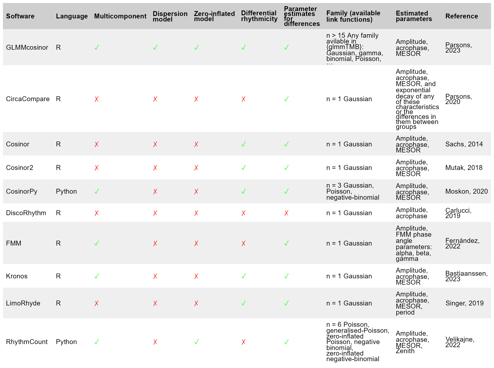
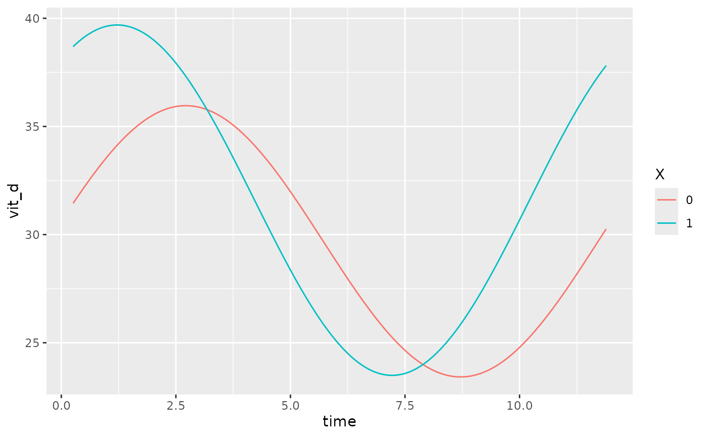
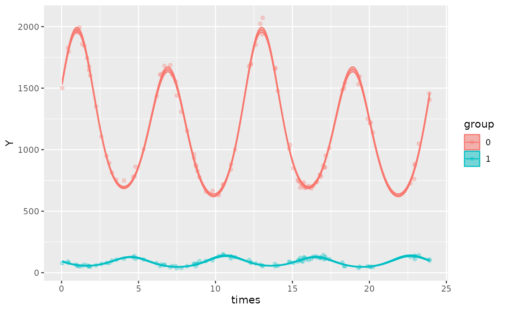
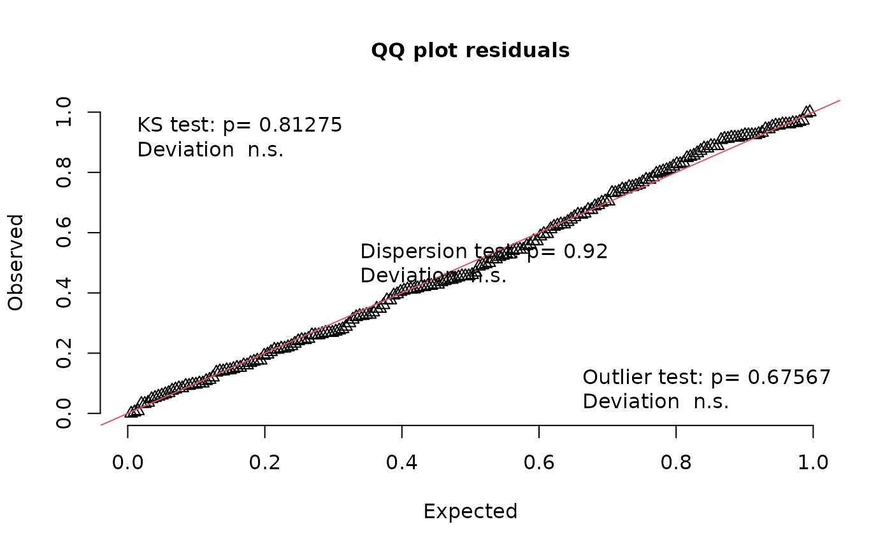
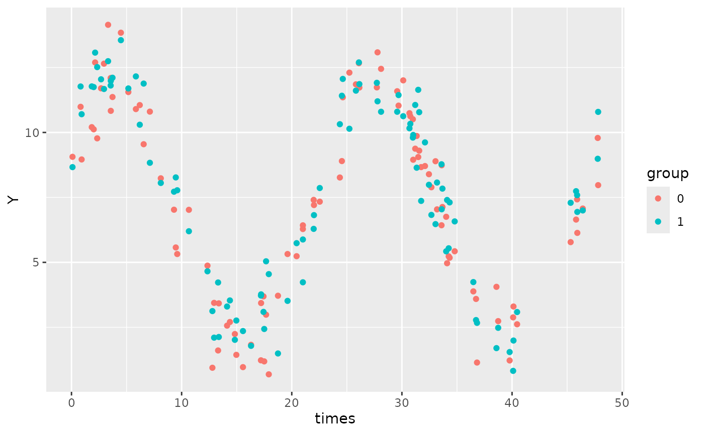

# GLMMcosinor

## An brief introduction to the cosinor model

A cosinor model aims to model the amplitude (A), acrophase (\phi), and
MESOR (M) of a rhythmic dataset.

- MESOR (M) is the Midline Estimating Statistic of Rhythm, and may also
  be referred to as the equilibrium point.

- Amplitude (A) is the difference between the MESOR and the maximum
  height of the rhythm.

- Acrophase (\phi) is the phase at which the maximal response occurs.

These could be modeled using a cosine function:

Y(t) = M + Acos(\frac{2\pi t}{\tau} - \phi) + e(t) where e(t) is the
error term.

However, these cannot be estimated using a linear modeling framework!
Other packages, including
[`{circacompare}`](https://cran.r-project.org/package=circacompare)
(Parsons et al. 2020), fit this exact nonlinear model but most packages
(including this one) require the user to specify a known period (\tau)
and decomposes this into linear terms, creating the cosinor model:

Y(t) = M + \beta x + \gamma z + e(t)

Where x =cos(\frac{2\pi t}{τ}), z =sin(\frac{2\pi t}{τ}), \beta = A
cos(\phi), \gamma = A sin(\phi)

This linear model is passed to the package
[`{glmmTMB}`](https://cran.r-project.org/package=glmmTMB) (Brooks et al.
2017) in `lme4` syntax. If the model has no random effects, `glmmTMB`
uses maximum likelihood estimation to estimate the linear coefficients
of the model. For models with random effects, a Laplace approximation is
used to integrate over the random effects. This approximation is handled
by the [`{TMB}`](https://cran.r-project.org/package=TMB)(Kristensen et
al. 2016) package which uses automatic differentiation of the joint
likelihood function to provide fast computations of parameter estimates.
A detailed explanation of this process is described
[here](https://doi.org/10.18637/jss.v070.i05) (Kristensen et al. 2016)

`glmmTMB` returns the estimates of the linear coefficients from the
linear model. To recover the estimates of the original parameters for
amplitude (A) and acrophase (\phi), the estimates for \hat\beta and
\hat\gamma must be transformed as per the following equations:

\hat\phi = \arctan(\frac{\hat\gamma}{\hat\beta})

\hat A = \sqrt{\hat\beta ^2 + \hat\gamma ^ 2} These transformed
parameters for acrophase and amplitude, along with MESOR are returned as
part of the `cglmm` output. For a more thorough introduction to cosinor
modeling, see [here](https://doi.org/10.1186%2F1742-4682-11-16)
(Cornelissen 2014).

The period of a rhythmic component cannot be directly estimated using
`GLMMcosinor.` To estimate the period, a nonlinear regression model must
be fit, which can be done by `circacompare` or a similar package.

## Introduction

[GLMMcosinor](https://docs.ropensci.org/GLMMcosinor) allows the user to
fit generalized linear models based on rhythmic data with a cosinor
model. It allows users to summarize, predict, and plot these models too.
Existing packages have focused primarily on Gaussian data. Some
circadian regression modeling packages have allowed users to specify
generalized linear models, but with limited flexibility.
[GLMMcosinor](https://docs.ropensci.org/GLMMcosinor) takes a
comprehensive approach to modeling by harnessing the
[glmmTMB](https://github.com/glmmTMB/glmmTMB) package, that has a wide
range of available link functions, allowing users to model rhythmic data
from a wide range of distributions (for full list - see
[`?family`](https://rdrr.io/r/stats/family.html) and
[`?glmmTMB::family_glmmTMB`](https://rdrr.io/pkg/glmmTMB/man/nbinom2.html))
including:

- Binomial
- Guassian
- Inverse Gaussian
- Gamma
- Poisson
- Negative Binomial

The table below shows what features are available within
[GLMMcosinor](https://docs.ropensci.org/GLMMcosinor) and other methods.



flextable methods

## `cglmm()`

[`cglmm()`](https://docs.ropensci.org/GLMMcosinor/reference/cglmm.md)
wrangles the data appropriately to fit the cosinor model given the
formula specified by the user. It returns a model, providing estimates
of amplitude, acrophase, and MESOR (Midline Statistic Of Rhythm).

The formula argument for
[`cglmm()`](https://docs.ropensci.org/GLMMcosinor/reference/cglmm.md) is
specified using the [lme4](https://github.com/lme4/lme4/) style (for
details see
[`vignette("lmer", package = "lme4")`](https://cran.rstudio.com/web/packages/lme4/vignettes/lmer.pdf)).
The only difference is that it allows for use of
[`amp_acro()`](https://docs.ropensci.org/GLMMcosinor/reference/amp_acro.md)
within the formula that is used to identify the cosinor (rhythmic)
components and relevant variables in the provided data. Any other
combination of covariates can also be included in the formula as well as
random effects. Additionally, zero-inflation (`ziformula`) and
dispersion (`dispformula`) formulae can be incorporated if required. For
detailed examples of how to specify these types of models, see the
[mixed-models](https://docs.ropensci.org/GLMMcosinor/articles/mixed-models.html),
[model-specification](https://docs.ropensci.org/GLMMcosinor/articles/model-specification.html)
and
[multiple-components](https://docs.ropensci.org/GLMMcosinor/articles/multiple-components.html)
vignettes.

For example, consider the following model and its output:

``` r

library(GLMMcosinor)
library(ggplot2)

cosinor_model <- cglmm(
  vit_d ~ X + amp_acro(time, period = 12, group = "X"),
  data = vitamind
)
```

Notice how both the raw and transformed coefficients are provided as
output. The adapted `data.frame` that was used to fit the raw model can
be accessed from the model and includes `main_rrr1` and `main_sss1`
columns of data:

``` r

head(cosinor_model$newdata)
#>      vit_d      time X  main_rrr1  main_sss1
#> 1 16.12091 11.439525 0  0.9572476 -0.2892699
#> 2 29.90624  5.807104 0 -0.9949038  0.1008285
#> 3 39.17572  1.045492 1  0.8538711  0.5204846
#> 4 35.15403  4.082983 1 -0.5371451  0.8434899
#> 5 43.67065 10.606247 1  0.7453295 -0.6666963
#> 6 31.20360  5.126054 0 -0.8971168  0.4417935
```

In this example, the `main` prefix indicates that this is the data for
the conditional model, as opposed to (potential) dispersion or
zero-inflation models, which have the prefixes `disp` and `zi`,
respectively. The numeric suffix, indicates that this is the data for
the first (and only) cosinor component. If there are multiple
components, the columns of data will be named accordingly.

## A basic overview of `cglmm()`

The
[`cglmm()`](https://docs.ropensci.org/GLMMcosinor/reference/cglmm.md)
function is used to fit cosinor models to a variety of distributions
using the `glmmTMB()` function.

``` r

cglmm(
  formula = vit_d ~ amp_acro(time, period = 12),
  data = vitamind,
  family = gaussian
)
#> 
#>  Conditional Model 
#> 
#>  Raw formula: 
#> vit_d ~ main_rrr1 + main_sss1 
#> 
#>  Raw Coefficients: 
#>             Estimate
#> (Intercept) 30.25470
#> main_rrr1    2.59421
#> main_sss1    5.75074
#> 
#>  Transformed Coefficients: 
#>             Estimate
#> (Intercept) 30.25470
#> amp          6.30879
#> acr          1.14702
```

- `formula`: A formula specifying the model structure, including the
  response variable and the cosinor components (using
  [`amp_acro()`](https://docs.ropensci.org/GLMMcosinor/reference/amp_acro.md)).
- `data`: The `data.frame` containing the variables used in the formula.
- `family`: The family of the distribution for the response variable
  (e.g., poisson, gaussian, or any family found
  in[`?family`](https://rdrr.io/r/stats/family.html) and
  [`?glmmTMB::family_glmmTMB`](https://rdrr.io/pkg/glmmTMB/man/nbinom2.html))

The
[`amp_acro()`](https://docs.ropensci.org/GLMMcosinor/reference/amp_acro.md)
function is used within the formula to specify the cosinor components.
It allows you to specify the period of the rhythm and, if necessary, the
grouping structure and the number of components. The arguments of
[`amp_acro()`](https://docs.ropensci.org/GLMMcosinor/reference/amp_acro.md)
are:

- `group`: The name of the grouping variable in the dataset.
- `time_col`: The name of the time column.
- `n_components`: The number of components in the cosinor model.
- `period`: The period(s) of the rhythm.

### Understanding the output

The most relevant output from the
[`cglmm()`](https://docs.ropensci.org/GLMMcosinor/reference/cglmm.md)
function is likely to be the parameter estimates for MESOR, amplitude,
and acrophase under the ‘Transformed Coefficients’ heading. These are
the recovered estimates mentioned at the beginning of this vignette: the
amplitude and phase. The ‘Raw Coefficients’ are the coefficients from
the cosinor model. In this example, the `main_rrr1` and `main_sss1`
correspond to \hat\beta and \hat\gamma in the first section,
respectively.

The following example fits a grouped single-component model with a
Guassian distribution (the default).

``` r

cglmm(
  vit_d ~ X + amp_acro(time, period = 12, group = "X"),
  data = vitamind
)
#> 
#>  Conditional Model 
#> 
#>  Raw formula: 
#> vit_d ~ X + X:main_rrr1 + X:main_sss1 
#> 
#>  Raw Coefficients: 
#>              Estimate
#> (Intercept)  29.68980
#> X1            1.90186
#> X0:main_rrr1  0.93078
#> X1:main_rrr1  6.51029
#> X0:main_sss1  6.20099
#> X1:main_sss1  4.81846
#> 
#>  Transformed Coefficients: 
#>             Estimate
#> (Intercept) 29.68980
#> [X=1]        1.90186
#> [X=0]:amp    6.27046
#> [X=1]:amp    8.09947
#> [X=0]:acr    1.42181
#> [X=1]:acr    0.63715
```

Under the ‘Transformed Coefficients’ heading:

- `(Intercept) = 29.6898`is the MESOR estimate of group 0

- `[X=1] = 1.90186` is the difference between the MESOR estimates of
  group 1 and 2 \*

- `[X=0]:amp = 6.27046` is the amplitude estimate for group 0

- `[X=1]:amp = 8.09947` is the amplitude estimate for group 1

- `[X=0]:acr = 1.42181` is the acrophase estimate in radians for group 0
  \*\*

- `[X=1]:acr = 0.63715` is the acrophase estimate in radians for group 1

\* Hence, the MESOR estimate for group 1 would be
`29.6898 + 1.90186 = 31.59166`. This is due to the behaviour of the
`glmmTMB()` function. This can be adjusted by adding a `0 +` to the
beginning of the formula:

``` r

cglmm(
  vit_d ~ 0 + X + amp_acro(time,
    period = 12,
    group = "X"
  ),
  data = vitamind
)
#> 
#>  Conditional Model 
#> 
#>  Raw formula: 
#> vit_d ~ X + X:main_rrr1 + X:main_sss1 - 1 
#> 
#>  Raw Coefficients: 
#>              Estimate
#> X0           29.68978
#> X1           31.59168
#> X0:main_rrr1  0.93078
#> X1:main_rrr1  6.51030
#> X0:main_sss1  6.20099
#> X1:main_sss1  4.81846
#> 
#>  Transformed Coefficients: 
#>           Estimate
#> [X=0]     29.68978
#> [X=1]     31.59168
#> [X=0]:amp  6.27046
#> [X=1]:amp  8.09948
#> [X=0]:acr  1.42181
#> [X=1]:acr  0.63715
```

Note how now, `[X=1] = 31.59165` and this represents the estimate for
the MESOR for group 1, rather than the difference.

\*\* Note how the acrophase is provided in units of radians. Since the
period is 12, an acrophase of 1.42181 radians corresponds to a time of
\frac{1.42181}{2 \pi} \times 12 = 2.715457. This means the maximum
response occurs at 2.715 time units. We can check this visually using
the
[`autoplot()`](https://ggplot2.tidyverse.org/reference/autoplot.html)
function, looking at the `[X=0]` level (red line)

``` r

cosinor_model <- cglmm(
  vit_d ~ 0 + X + amp_acro(time,
    period = 12,
    group = "X"
  ),
  data = vitamind
)
autoplot(cosinor_model, predict.ribbon = FALSE)
```



## More advanced `cglmm()` model specification

The
[`cglmm()`](https://docs.ropensci.org/GLMMcosinor/reference/cglmm.md)
function allows you to specify different types of cosinor models with or
without grouping variables. The function can also generate dispersion
models and zero-inflation models. For more detailed explanations and
examples, see the
[model-specification](https://docs.ropensci.org/GLMMcosinor/articles/model-specification.html)
article.

Additionally, the
[`cglmm()`](https://docs.ropensci.org/GLMMcosinor/reference/cglmm.md)
function provides more advanced functionality for multi-component
models, and detailed explanations can be found in the
[multiple-components](https://docs.ropensci.org/GLMMcosinor/articles/multiple-components.html)
article.

The
[`cglmm()`](https://docs.ropensci.org/GLMMcosinor/reference/cglmm.md)
function also allows mixed model specification. See the
[mixed-models](https://docs.ropensci.org/GLMMcosinor/articles/mixed-models.html)
article for more details.

## Using `summary()` and testing for differences between estimates

The [`summary()`](https://rdrr.io/r/base/summary.html) method for the
outputs from
[`cglmm()`](https://docs.ropensci.org/GLMMcosinor/reference/cglmm.md)
provides a more detailed summary of the model and its parameter
estimates and uncertainty. It outputs the estimates, standard errors,
confidence intervals, and p-values for both the raw model parameters and
the transformed parameters. Note that the p-values represent differences
for that parameter from zero, something which may not be particularly
relevant in all cases (i.e. differences in acrophase from zero). The
summary statistics do not represent a comparison between any groups for
the cosinor components - that is the role of the
[`test_cosinor_components()`](https://docs.ropensci.org/GLMMcosinor/reference/test_cosinor_components.md)
and
[`test_cosinor_levels()`](https://docs.ropensci.org/GLMMcosinor/reference/test_cosinor_levels.md)
functions.

Here is an example of how to use
[`summary()`](https://rdrr.io/r/base/summary.html) with some simulated
data:

``` r

testdata_simple <- simulate_cosinor(
  1000,
  n_period = 2,
  mesor = 5,
  amp = 2,
  acro = 1,
  beta.mesor = 4,
  beta.amp = 1,
  beta.acro = 0.5,
  family = "poisson",
  period = 12,
  n_components = 1,
  beta.group = TRUE
)
```

``` r

object <- cglmm(
  Y ~ group + amp_acro(times, period = 12, group = "group"),
  data = testdata_simple, family = poisson()
)
summary(object)
#> 
#>  Conditional Model 
#> Raw model coefficients:
#>                      estimate standard.error     lower.CI upper.CI    p.value
#> (Intercept)       4.998454142    0.003463730  4.991665356  5.00524 < 2.22e-16
#> group1           -1.002150000    0.005937109 -1.013786521 -0.99051 < 2.22e-16
#> group0:main_rrr1  1.082281784    0.003347565  1.075720677  1.08884 < 2.22e-16
#> group1:main_rrr1  0.876651963    0.006198710  0.864502714  0.88880 < 2.22e-16
#> group0:main_sss1  1.682350718    0.003919418  1.674668800  1.69003 < 2.22e-16
#> group1:main_sss1  0.481951763    0.005936670  0.470316104  0.49359 < 2.22e-16
#>                     
#> (Intercept)      ***
#> group1           ***
#> group0:main_rrr1 ***
#> group1:main_rrr1 ***
#> group0:main_sss1 ***
#> group1:main_sss1 ***
#> ---
#> Signif. codes:  0 '***' 0.001 '**' 0.01 '*' 0.05 '.' 0.1 ' ' 1
#> 
#> Transformed coefficients:
#>                    estimate standard.error     lower.CI upper.CI    p.value    
#> (Intercept)     4.998454142    0.003463730  4.991665356  5.00524 < 2.22e-16 ***
#> [group=1]      -1.002150000    0.005937109 -1.013786521 -0.99051 < 2.22e-16 ***
#> [group=0]:amp1  2.000409408    0.004275553  1.992029478  2.00879 < 2.22e-16 ***
#> [group=1]:amp1  1.000398004    0.006379631  0.987894156  1.01290 < 2.22e-16 ***
#> [group=0]:acr1  0.999134804    0.001439122  0.996314177  1.00196 < 2.22e-16 ***
#> [group=1]:acr1  0.502662067    0.005739524  0.491412807  0.51391 < 2.22e-16 ***
#> ---
#> Signif. codes:  0 '***' 0.001 '**' 0.01 '*' 0.05 '.' 0.1 ' ' 1
```

If we wanted to test the difference between the amplitude estimate for
component 1 between `group 1` and `group 2`, we can use the
[`test_cosinor_levels()`](https://docs.ropensci.org/GLMMcosinor/reference/test_cosinor_levels.md)
function:

``` r

test_cosinor_levels(object, x_str = "group", param = "amp")
#> Test Details: 
#> Parameter being tested:
#> Amplitude
#> 
#> Comparison type:
#> levels
#> 
#> Grouping variable used for comparison between groups: group
#> Reference group: 0
#> Comparator group: 1
#> 
#> cglmm model only has a single component and to compare
#>           between groups.
#> 
#> 
#> 
#> Global test: 
#> Statistic: 
#> 16955.27
#> 
#> P-value: 
#> 0
#> 
#> 
#> Individual tests:
#> Statistic: 
#> -130.21
#> 
#> P-value: 
#> 0
#> 
#> Estimate and 95% confidence interval:
#> -1 (-1.02 to -0.98)
```

The estimate here is the estimate of the difference between the inputted
values, along with its confidence interval. The real parameters for
`amp` in the first component were 2 and 1 for groups 0 and 1
respectively, and so the difference is approximately -1.

Now, consider an example where the difference is not so clear.

``` r

testdata_poisson <- simulate_cosinor(100,
  n_period = 2,
  mesor = 7,
  amp = c(0.1, 0.5),
  acro = c(1, 1),
  beta.mesor = 4.4,
  beta.amp = c(0.1, 0.46),
  beta.acro = c(0.5, -1.5),
  family = "poisson",
  period = c(12, 6),
  n_components = 2,
  beta.group = TRUE
)
```

``` r

cosinor_model <- cglmm(
  Y ~ group + amp_acro(times,
    period = c(12, 6),
    n_components = 2,
    group = "group"
  ),
  data = testdata_poisson,
  family = poisson()
)
test_cosinor_levels(
  cosinor_model,
  x_str = "group",
  param = "amp",
  component_index = 1
)
#> Test Details: 
#> Parameter being tested:
#> Amplitude
#> 
#> Comparison type:
#> levels
#> 
#> Grouping variable used for comparison between groups: group
#> Reference group: 0
#> Comparator group: 1
#> 
#> cglmm model has2 components. Component 1 is being used for comparison between groups.
#> 
#> 
#> 
#> Global test: 
#> Statistic: 
#> 0.05
#> 
#> P-value: 
#> 0.8245
#> 
#> 
#> Individual tests:
#> Statistic: 
#> -0.22
#> 
#> P-value: 
#> 0.8245
#> 
#> Estimate and 95% confidence interval:
#> 0 (-0.04 to 0.03)
```

In this example, there is no significant difference in the estimate of
`amp` for the first component between the reference group and the
comparator group. Also notice how if we are comparing between levels, we
should keep the component the same, and that is what `component_index`
sets. Likewise, when we test between components using
[`test_cosinor_components()`](https://docs.ropensci.org/GLMMcosinor/reference/test_cosinor_components.md),
we can indicate which level this comparison occurs using `level_index`.
There may be multiple `groups`, in which case we can fix the `group`
using the `x_str` argument.

As an example of testing the difference between components for the same
level:

``` r

test_cosinor_components(
  cosinor_model,
  x_str = "group",
  param = "acr",
  level_index = 1
)
#> Test Details: 
#> Parameter being tested:
#> Acrophase
#> 
#> Comparison type:
#> components
#> 
#> Component indices used for comparison between groups: group
#> Reference component: 1
#> Comparator component: 2
#> 
#> 
#> Global test: 
#> Statistic: 
#> 154.29
#> 
#> P-value: 
#> 0
#> 
#> 
#> Individual tests:
#> Statistic: 
#> 12.42
#> 
#> P-value: 
#> 0
#> 
#> Estimate and 95% confidence interval:
#> 1.89 (1.59 to 2.19)
```

In this situation, there is a significant difference between the
acrophase for the comparator group between its two components.

## Using `predict()`

The [`predict()`](https://rdrr.io/r/stats/predict.html) method allows
users to get predicted values from the model on either the existing or
new data.

``` r

cbind(predictions = predict(cosinor_model, type = "response"), testdata_poisson)
```

    #>   predictions    Y     times group
    #> 1    865.8332  871 17.009450     0
    #> 2    701.2750  714 10.503837     0
    #> 3    798.4445  861  4.800118     0
    #> 4   1551.0482 1541 18.409584     0
    #> 5   1733.9702 1699 12.315885     0
    #> 6   1972.1517 1951  1.072893     0

## Plotting `cglmm` objects

The [GLMMcosinor](https://docs.ropensci.org/GLMMcosinor) package
includes two ways to visualize
[`cglmm()`](https://docs.ropensci.org/GLMMcosinor/reference/cglmm.md)
objects. Firstly, the
[`autoplot()`](https://ggplot2.tidyverse.org/reference/autoplot.html)
method creates a time-response plot of the fitted model for all groups:

``` r

autoplot(cosinor_model, superimpose.data = TRUE)
```



This function also allows users to superimpose the data (that was used
to fit the model) over the fitted model, using the
`superimpose.data = TRUE`, as demonstrated above. By default, the
generated plot will have x-limits corresponding to the minimum and
maximum values of the time-vector in the original dataframe, although
the x-limits can be manually defined by the user using the `xlims`
argument. The details of using the `autoplot` function are found in the
[model-visualization](https://docs.ropensci.org/GLMMcosinor/articles/model-visualizations.html)
vignette.

## Large datasets

`glmmTMB` is an excellent package which can efficiently handle fitting
models to large datasets. This may be particularly relevant to those
using large biological datasets with very high frequency data
collection. Here we show the time required to fit a the same model as
above (Poisson cosinor model with a comparison between two groups) but
with 100,000 observations from each group.

``` r

d_large <- simulate_cosinor(100000,
  n_period = 2,
  mesor = 7,
  amp = c(0.1, 0.5),
  acro = c(1, 1),
  beta.mesor = 4.4,
  beta.amp = c(0.1, 0.46),
  beta.acro = c(0.5, -1.5),
  family = "poisson",
  period = c(12, 6),
  n_components = 2,
  beta.group = TRUE
)
```

``` r

start <- Sys.time()
cosinor_model <- cglmm(
  Y ~ group + amp_acro(times,
    period = c(12, 6),
    n_components = 2,
    group = "group"
  ),
  data = d_large,
  family = poisson()
)
end <- Sys.time()
print(end - start)
#> Time difference of 5.175664 secs
```

## Assessing residual diagnostics of `cglmm` regression models using DHARMa

[DHARMa](http://florianhartig.github.io/DHARMa/) is an R package used to
assess residual diagnostics of regression models fit using
[glmmTMB](https://github.com/glmmTMB/glmmTMB) (which is what is used by
[`cglmm()`](https://docs.ropensci.org/GLMMcosinor/reference/cglmm.md)).

For example, we can apply the functions from `DHARMa` on the `glmmTMB`
model within by accessing it with `$fit`.

``` r

library(DHARMa)
#> This is DHARMa 0.5.0. For overview type '?DHARMa'. For recent changes, type news(package = 'DHARMa') 
#> 
#> Note that the default setting in simulateResiduals was changed to conditional simulations since version 0.5.0. This is likely to change residual calculations for all hierarchical (in particular random effect) models. If you want to switch back to the old package version defaults, please use the argument simulateREs = "user-specified" in simulateResiduals(). For more details, see ?simulateREsiduals.
cosinor_model <- cglmm(
  vit_d ~ X + amp_acro(time, period = 12, group = "X"),
  data = vitamind
)

plotResiduals(simulateResiduals(cosinor_model$fit))
```


``` r

plotQQunif(simulateResiduals(cosinor_model$fit))
```



## Differential rhythmicity

Researchers may be interested to know whether two rhythms are different
from each other, overall, rather than regarding a single rhythmic
parameter. To assess this, two models can be fit, one with the
parameterisation for the grouping variable and one without. By
performing the comparison at the model level, it is up to the user to
exactly control the parameterisation. For example, they may want to test
for differential fit regarding only the amplitude/acrophase collectively
but still include grouping as an interaction to other covariates.

To perform the test, fit two models: one with the grouping structure and
one without.

``` r

cosinor_model_unpooled <- cglmm(
  vit_d ~ X + amp_acro(time, period = 12, group = "X"),
  data = vitamind
)

cosinor_model_pooled <- cglmm(
  vit_d ~ amp_acro(time, period = 12),
  data = vitamind
)

anova(cosinor_model_pooled$fit, cosinor_model_unpooled$fit)
#> Data: newdata
#> Models:
#> cosinor_model_pooled$fit: vit_d ~ main_rrr1 + main_sss1, zi=~1 - 1, disp=~1
#> cosinor_model_unpooled$fit: vit_d ~ X + X:main_rrr1 + X:main_sss1, zi=~1 - 1, disp=~1
#>                            Df  AIC    BIC  logLik deviance  Chisq Chi Df
#> cosinor_model_pooled$fit    4 1270 1283.2 -631.02     1262              
#> cosinor_model_unpooled$fit  7 1246 1269.1 -616.02     1232 30.009      3
#>                            Pr(>Chisq)    
#> cosinor_model_pooled$fit                 
#> cosinor_model_unpooled$fit  1.374e-06 ***
#> ---
#> Signif. codes:  0 '***' 0.001 '**' 0.01 '*' 0.05 '.' 0.1 ' ' 1
```

The AIC for the unpooled model is lower than the pooled model, and the
difference in the fit is statistically significant, supporting a
differential fit between the two levels of the grouping.

If we use simulated data with no difference in the underlying rhythm,
this test does not support a differential fit.

``` r

testdata_no_difference <- simulate_cosinor(
  100,
  n_period = 2,
  mesor = 7,
  amp = 5,
  acro = 1,
  beta.mesor = 7,
  beta.amp = 5,
  beta.acro = 1,
  period = 24,
  n_components = 1,
  beta.group = TRUE
)
```

``` r

testdata_no_difference$group <- as.factor(testdata_no_difference$group)

testdata_no_difference |>
  ggplot(aes(x = times, y = Y, col = group)) +
  geom_point()
```



``` r


cosinor_model_unpooled <- cglmm(
  Y ~ group + amp_acro(times, period = 24, group = "group"),
  data = testdata_no_difference
)

cosinor_model_pooled <- cglmm(
  Y ~ amp_acro(times, period = 24),
  data = testdata_no_difference
)

anova(cosinor_model_pooled$fit, cosinor_model_unpooled$fit)
#> Data: newdata
#> Models:
#> cosinor_model_pooled$fit: Y ~ main_rrr1 + main_sss1, zi=~1 - 1, disp=~1
#> cosinor_model_unpooled$fit: Y ~ group + group:main_rrr1 + group:main_sss1, zi=~1 - 1, disp=~1
#>                            Df    AIC    BIC  logLik deviance  Chisq Chi Df
#> cosinor_model_pooled$fit    4 562.82 576.01 -277.41   554.82              
#> cosinor_model_unpooled$fit  7 564.53 587.62 -275.27   550.53 4.2867      3
#>                            Pr(>Chisq)
#> cosinor_model_pooled$fit             
#> cosinor_model_unpooled$fit     0.2321
```

## References

Brooks, Mollie E., Kasper Kristensen, Koen J. van Benthem, et al. 2017.
“glmmTMB Balances Speed and Flexibility Among Packages for Zero-Inflated
Generalized Linear Mixed Modeling.” *The R Journal* 9 (2): 378–400.
<https://doi.org/10.32614/RJ-2017-066>.

Cornelissen, Germaine. 2014. “Cosinor-Based Rhythmometry.” *Theoretical
Biology and Medical Modelling* 11 (1): 1–24.

Kristensen, Kasper, Anders Nielsen, Casper W. Berg, Hans Skaug, and
Bradley M. Bell. 2016. “TMB: Automatic Differentiation and Laplace
Approximation.” *Journal of Statistical Software* 70 (5): 1–21.
<https://doi.org/10.18637/jss.v070.i05>.

Parsons, Rex, Richard Parsons, Nicholas Garner, Henrik Oster, and Oliver
Rawashdeh. 2020. “CircaCompare: A Method to Estimate and Statistically
Support Differences in Mesor, Amplitude and Phase, Between Circadian
Rhythms.” *Bioinformatics* 36 (4): 1208–12.
