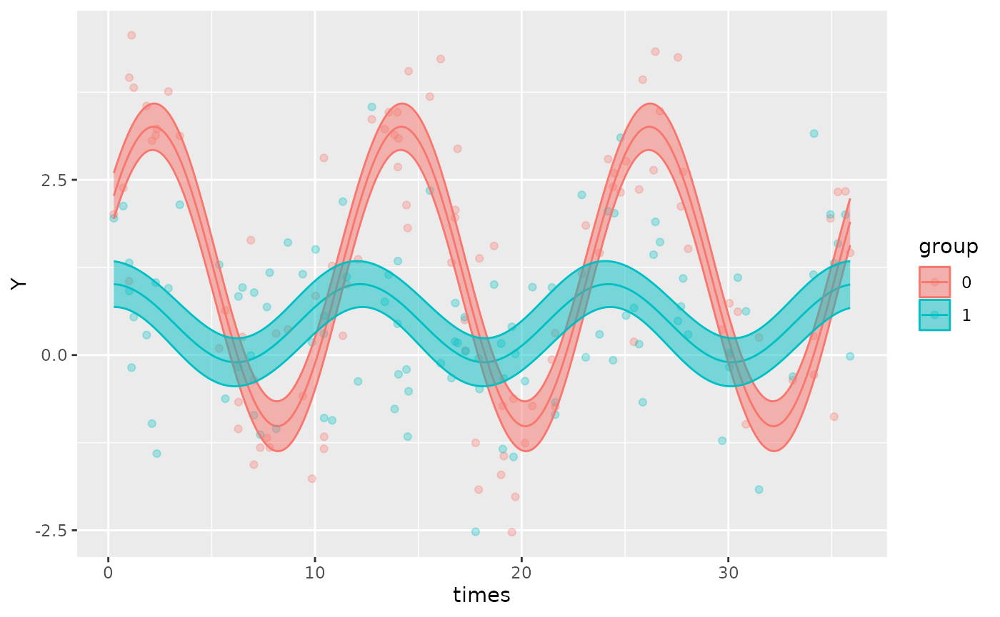
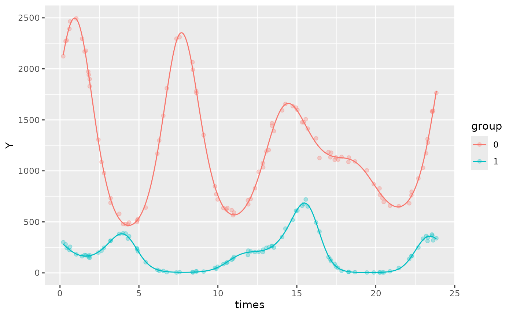
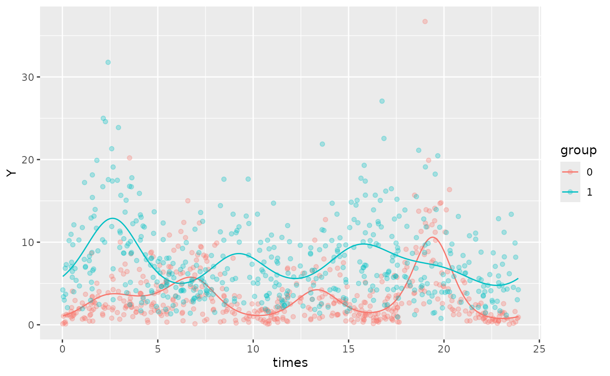

# Simulating data

``` r

library(GLMMcosinor)
```

## Simulating rhythmic data

`simulate_cosinor` allows users to simulate circadian data from
Gaussian, Gamma, Binomial, or Poisson distributions. It also supports
generation of multi-component data, as well as simulation of grouped
data with two levels.

### Understanding the inputs for a simple model

`n` specifies the number of datapoints.

`mesor`, `amp`, and `acro` represent the parameters that will be used to
simulate the dataset. Note that `acro` should be expressed in units of
radians.

`period` determines the period of the dataset

`n_components` corresponds to the number of components in the simulated
dataset. Details about how to specify a multi-component model are
included later in this vignette

The `family` argument determines the distribution that the data is
simulated from. Currently, `simulate_cosinor` supports simulations from
Gaussian, Gamma, Binomial, and Poisson distributions:

- `family = 'gaussian'`

- `family = 'gamma'`

- `family = 'binomial'`

- `family = 'poisson'`

Note that the `…` parameter controls extra arguments such as standard
deviation, and the shape parameter for a Gamma distribution:

- `sd` controls the standard deviation when sampling from a normal
  distribution. `sd` is set to 1 by default

- `alpha` controls the shape parameter for the Gamma distribution.
  `alpha` is set to 1 by default

`n_period` is the number of periods that are simulated. By default, the
maximum period supplied defines the upper limit of the time vector used
in the simulation. Thus, increasing `n_period` increases the number of
cycles that are simulated.

Consider the following example of a single-component Poisson data-set
with no grouping variable:

``` r

testdata <- simulate_cosinor(
  n = 200,
  mesor = 1,
  amp = 2,
  acro = 1.2,
  period = 12,
  n_period = 3,
  family = "poisson"
)

testdata
```

Now, let’s fit a
[`cglmm()`](https://docs.ropensci.org/GLMMcosinor/reference/cglmm.md)
model to this simulated dataset to see how it matches with our original
parameters:

``` r

object <- cglmm(
  Y ~ amp_acro(times,
    n_components = 1,
    period = 12
  ),
  data = testdata,
  family = poisson()
)
summary(object)
autoplot(object, superimpose.data = TRUE)
```

### Simulating grouped cosinor data

The
[`simulate_cosinor()`](https://docs.ropensci.org/GLMMcosinor/reference/simulate_cosinor.md)
function can simulate grouped data from two levels with their own
parameters when `beta.group = TRUE`. The reference group is specified by
the parameters `mesor`, `amp`, `acro`. The treatment group is specified
in the same manner, but with the `beta` prefix. For example:

- `beta.mesor`

- `beta.amp`

- `beta.acro`

Similarly, the standard deviation (`sd)` for the Gaussian distribution
or the `alpha` parameter for the Gamma distribution are specified as:

- `beta.sd` (1 by default)

- `beta.alpha` (1 by default)

``` r

simulate_cosinor(
  n = 100,
  mesor = 1,
  amp = 2,
  acro = 1.2,
  period = 12,
  beta.group = TRUE,
  beta.mesor = 0.4,
  beta.amp = 0.5,
  beta.acro = 0.2,
  n_period = 3,
  n_components = 1,
  family = "poisson"
)
```

    #> 
    #>  Conditional Model 
    #> Raw model coefficients:
    #>                     estimate standard.error    lower.CI upper.CI    p.value    
    #> (Intercept)       1.12116490     0.10184899  0.92154455  1.32079 < 2.22e-16 ***
    #> group1           -0.66674408     0.14403622 -0.94904988 -0.38444 3.6743e-06 ***
    #> group0:main_rrr1  0.88802706     0.13903539  0.61552272  1.16053 1.6911e-10 ***
    #> group1:main_rrr1  0.55450750     0.13903539  0.28200316  0.82701 6.6563e-05 ***
    #> group0:main_sss1  1.94285441     0.15189401  1.64514763  2.24056 < 2.22e-16 ***
    #> group1:main_sss1  0.05251341     0.15189401 -0.24519337  0.35022    0.72955    
    #> ---
    #> Signif. codes:  0 '***' 0.001 '**' 0.01 '*' 0.05 '.' 0.1 ' ' 1
    #> 
    #> Transformed coefficients:
    #>                   estimate standard.error    lower.CI upper.CI    p.value    
    #> (Intercept)     1.12116490     0.10184899  0.92154455  1.32079 < 2.22e-16 ***
    #> [group=1]      -0.66674408     0.14403622 -0.94904988 -0.38444 3.6743e-06 ***
    #> [group=0]:amp1  2.13618242     0.14272487  1.85644681  2.41592 < 2.22e-16 ***
    #> [group=1]:amp1  0.55698854     0.13730969  0.28786649  0.82611 4.9826e-05 ***
    #> [group=0]:acr1  1.14207576     0.06948499  1.00588769  1.27826 < 2.22e-16 ***
    #> [group=1]:acr1  0.09442120     0.27550976 -0.44556801  0.63441    0.73181    
    #> ---
    #> Signif. codes:  0 '***' 0.001 '**' 0.01 '*' 0.05 '.' 0.1 ' ' 1



### Simulating multi-component cosinor data

To simulate multi-component data with the number of components
corresponding to `n_components` , specify a vector of values for the
parameter inputs, `amp`, `acro`, and `period`. Since only one `mesor` is
provided for a multi-component cosinor curve, the `mesor` argument in
`simualte_cosinor` will only accept single-element inputs. For example:

``` r

testdata <- simulate_cosinor(
  n = 200,
  mesor = 1,
  amp = c(0.2, 1),
  acro = c(1.2, 2),
  period = c(12, 6),
  n_components = 2,
  n_period = 2,
  family = "poisson"
)

testdata
object <- cglmm(
  Y ~ amp_acro(times,
    n_components = 2,
    period = c(12, 6)
  ),
  data = testdata,
  family = poisson()
)
summary(object)
autoplot(object, superimpose.data = TRUE)
```

In this example:

- `mesor = 1` suggests that the intercept of the overall cosinor curve
  (accounting for all components) is 1

- `amp=c(0.2,1)` indicates that the amplitude of the first component is
  0.2, and the second is 1

- `acro = c(1.2, 2)` indicates that the acrophase of the first component
  is 1.2 radians, and the second is 2 radians

- `period = c(12, 6)` indicates that the period of the first component
  is 12 units, and the second is 6 units.

- `n_components = 2`, because we are specifying a two-component dataset

To simulate a dataset with more than two components, specify more
elements in the vector inputs for these parameters. Ensure that the
number of inputs for each parameter corresponds to the number of
components specified in `n_components`. For example, if
`n_components = 3`, then `amp`, `acro`, `period` must all have 3
elements corresponding to each of the three components.

The following are examples of a multi-component cosinor dataset with
multiple groups. The first one is from a Poisson distribution, and the
second is from a Gamma distribution

``` r

testdata <- simulate_cosinor(100,
  mesor = 7,
  amp = c(0.1, 0.4, 0.5),
  acro = c(1, 1.5, 0.1),
  beta.mesor = 4.4,
  beta.amp = c(2, 1, 0.4),
  beta.acro = c(1, -1.5, -1),
  family = "poisson",
  period = c(12, 6, 8),
  n_period = 2,
  n_components = 3
)

object <- cglmm(Y ~ group + amp_acro(times,
  n_components = 3,
  period = c(12, 6, 8),
  group = "group"
), data = testdata, family = poisson())
summary(object)
#> 
#>  Conditional Model 
#> Raw model coefficients:
#>                      estimate standard.error     lower.CI upper.CI    p.value
#> (Intercept)       6.998354005    0.003253938  6.991976404  7.00473 < 2.22e-16
#> group1           -2.592232609    0.018835942 -2.629150377 -2.55531 < 2.22e-16
#> group0:main_rrr1  0.044557196    0.004155847  0.036411886  0.05270 < 2.22e-16
#> group1:main_rrr1  1.074642116    0.020749438  1.033973966  1.11531 < 2.22e-16
#> group0:main_sss1  0.083480030    0.004337486  0.074978714  0.09198 < 2.22e-16
#> group1:main_sss1  1.669438105    0.024612013  1.621199446  1.71768 < 2.22e-16
#> group0:main_rrr2  0.030533798    0.004128972  0.022441162  0.03863  1.414e-13
#> group1:main_rrr2  0.047809864    0.013803489  0.020755522  0.07486 0.00053298
#> group0:main_sss2  0.397891462    0.004252676  0.389556370  0.40623 < 2.22e-16
#> group1:main_sss2 -1.000818250    0.017290648 -1.034707296 -0.96693 < 2.22e-16
#> group0:main_rrr3  0.499430452    0.004328507  0.490946734  0.50791 < 2.22e-16
#> group1:main_rrr3  0.212646480    0.009497746  0.194031240  0.23126 < 2.22e-16
#> group0:main_sss3  0.042194110    0.004072380  0.034212393  0.05018 < 2.22e-16
#> group1:main_sss3 -0.344588877    0.011411108 -0.366954238 -0.32222 < 2.22e-16
#>                     
#> (Intercept)      ***
#> group1           ***
#> group0:main_rrr1 ***
#> group1:main_rrr1 ***
#> group0:main_sss1 ***
#> group1:main_sss1 ***
#> group0:main_rrr2 ***
#> group1:main_rrr2 ***
#> group0:main_sss2 ***
#> group1:main_sss2 ***
#> group0:main_rrr3 ***
#> group1:main_rrr3 ***
#> group0:main_sss3 ***
#> group1:main_sss3 ***
#> ---
#> Signif. codes:  0 '***' 0.001 '**' 0.01 '*' 0.05 '.' 0.1 ' ' 1
#> 
#> Transformed coefficients:
#>                    estimate standard.error     lower.CI upper.CI    p.value    
#> (Intercept)     6.998354005    0.003253938  6.991976404  7.00473 < 2.22e-16 ***
#> [group=1]      -2.592232609    0.018835942 -2.629150377 -2.55531 < 2.22e-16 ***
#> [group=0]:amp1  0.094626947    0.004055983  0.086677366  0.10258 < 2.22e-16 ***
#> [group=1]:amp1  1.985416648    0.029473535  1.927649582  2.04318 < 2.22e-16 ***
#> [group=0]:amp2  0.399061309    0.004276099  0.390680310  0.40744 < 2.22e-16 ***
#> [group=1]:amp2  1.001959556    0.017384846  0.967885885  1.03603 < 2.22e-16 ***
#> [group=0]:amp3  0.501209656    0.004311730  0.492758820  0.50966 < 2.22e-16 ***
#> [group=1]:amp3  0.404919769    0.010630637  0.384084104  0.42576 < 2.22e-16 ***
#> [group=0]:acr1  1.080517178    0.046826088  0.988739731  1.17229 < 2.22e-16 ***
#> [group=1]:acr1  0.998852179    0.006520588  0.986072061  1.01163 < 2.22e-16 ***
#> [group=0]:acr2  1.494207419    0.010285914  1.474047398  1.51437 < 2.22e-16 ***
#> [group=1]:acr2 -1.523061840    0.013657898 -1.549830827 -1.49629 < 2.22e-16 ***
#> [group=0]:acr3  0.084284306    0.008160534  0.068289953  0.10028 < 2.22e-16 ***
#> [group=1]:acr3 -1.017896654    0.025594912 -1.068061759 -0.96773 < 2.22e-16 ***
#> ---
#> Signif. codes:  0 '***' 0.001 '**' 0.01 '*' 0.05 '.' 0.1 ' ' 1
autoplot(object,
  superimpose.data = TRUE,
  x_str = "group",
  predict.ribbon = FALSE
)
```



``` r

testdata <- simulate_cosinor(500,
  mesor = 1,
  amp = c(0.5, 0.5, 0.5),
  acro = c(pi, pi / 2, pi),
  alpha = 2,
  beta.mesor = 2,
  beta.amp = c(0.2, 0.2, 0.2),
  beta.acro = c(pi / 2, pi, pi / 2),
  beta.alpha = 3,
  family = "gamma",
  period = c(12, 6, 8),
  n_period = 2,
  n_components = 3
)

object <- cglmm(Y ~ group + amp_acro(times,
  n_components = 3,
  period = c(12, 6, 8),
  group = "group"
), data = testdata, family = Gamma(link = "log"))
summary(object)
#> 
#>  Conditional Model 
#> Raw model coefficients:
#>                     estimate standard.error    lower.CI upper.CI    p.value    
#> (Intercept)       1.01896530     0.02848404  0.96313761  1.07479 < 2.22e-16 ***
#> group1            0.96690011     0.04027263  0.88796720  1.04583 < 2.22e-16 ***
#> group0:main_rrr1 -0.56669761     0.03946522 -0.64404802 -0.48935 < 2.22e-16 ***
#> group1:main_rrr1 -0.05275334     0.03942696 -0.13002877  0.02452    0.18090    
#> group0:main_sss1  0.04566844     0.04141021 -0.03549407  0.12683    0.27010    
#> group1:main_sss1  0.20364525     0.04112574  0.12304027  0.28425 7.3541e-07 ***
#> group0:main_rrr2  0.02476630     0.04124489 -0.05607220  0.10560    0.54819    
#> group1:main_rrr2 -0.18934039     0.04135922 -0.27040296 -0.10828 4.6956e-06 ***
#> group0:main_sss2  0.58726498     0.03941810  0.51000693  0.66452 < 2.22e-16 ***
#> group1:main_sss2  0.02627528     0.03897592 -0.05011611  0.10267    0.50022    
#> group0:main_rrr3 -0.42914234     0.03954651 -0.50665208 -0.35163 < 2.22e-16 ***
#> group1:main_rrr3  0.01590103     0.03977800 -0.06206241  0.09386    0.68934    
#> group0:main_sss3 -0.03853448     0.04072274 -0.11834959  0.04128    0.34401    
#> group1:main_sss3  0.23069385     0.04006178  0.15217421  0.30921 8.4888e-09 ***
#> ---
#> Signif. codes:  0 '***' 0.001 '**' 0.01 '*' 0.05 '.' 0.1 ' ' 1
#> 
#> Transformed coefficients:
#>                   estimate standard.error    lower.CI upper.CI    p.value    
#> (Intercept)     1.01896530     0.02848404  0.96313761  1.07479 < 2.22e-16 ***
#> [group=1]       0.96690011     0.04027263  0.88796720  1.04583 < 2.22e-16 ***
#> [group=0]:amp1  0.56853477     0.03936314  0.49138444  0.64569 < 2.22e-16 ***
#> [group=1]:amp1  0.21036706     0.04069777  0.13060089  0.29013 2.3534e-07 ***
#> [group=0]:amp2  0.58778698     0.03943642  0.51049301  0.66508 < 2.22e-16 ***
#> [group=1]:amp2  0.19115484     0.04115101  0.11050033  0.27181 3.3974e-06 ***
#> [group=0]:amp3  0.43086895     0.03978630  0.35288925  0.50885 < 2.22e-16 ***
#> [group=1]:amp3  0.23124120     0.04013566  0.15257676  0.30991 8.3375e-09 ***
#> [group=0]:acr1  3.06117946     0.07300742  2.91808755  3.20427 < 2.22e-16 ***
#> [group=1]:acr1  1.82426992     0.18951910  1.45281930  2.19572 < 2.22e-16 ***
#> [group=0]:acr2  1.52864903     0.07013999  1.39117718  1.66612 < 2.22e-16 ***
#> [group=1]:acr2  3.00370061     0.20504673  2.60181641  3.40558 < 2.22e-16 ***
#> [group=0]:acr3 -3.05203866     0.09396942 -3.23621534 -2.86786 < 2.22e-16 ***
#> [group=1]:acr3  1.50197819     0.17169713  1.16545800  1.83850 < 2.22e-16 ***
#> ---
#> Signif. codes:  0 '***' 0.001 '**' 0.01 '*' 0.05 '.' 0.1 ' ' 1
autoplot(object,
  superimpose.data = TRUE,
  x_str = "group",
  predict.ribbon = FALSE
)
```


