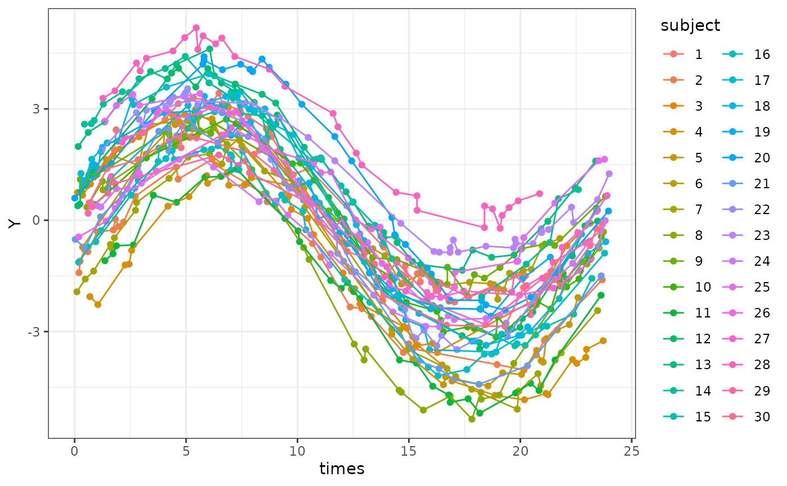
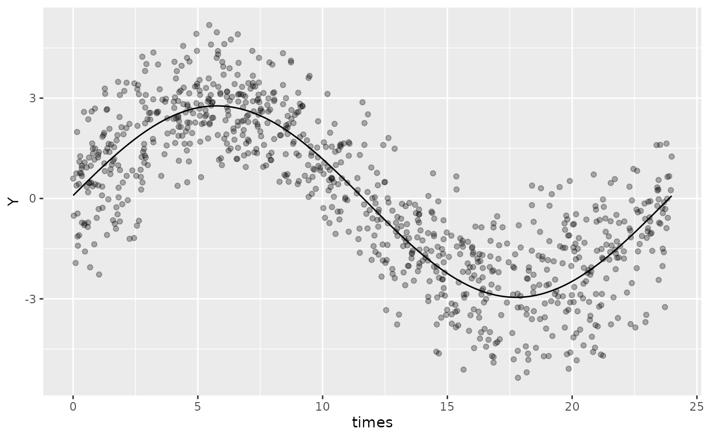
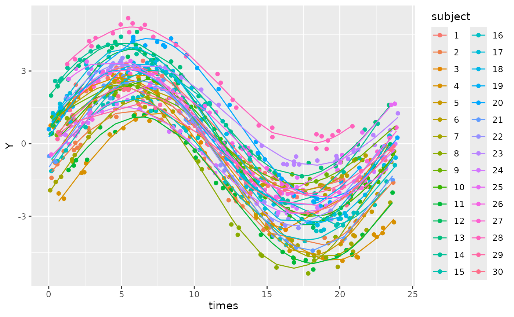

# Mixed models

``` r

library(GLMMcosinor)
library(dplyr)
library(ggplot2)
```

[GLMMcosinor](https://docs.ropensci.org/GLMMcosinor) allows
specification of mixed models accounting for fixed and/or random
effects. Mixed model specification follows the
[lme4](https://github.com/lme4/lme4/) format. See their vignette,
[Fitting Linear Mixed-Effects Models Using
lme4](https://cran.r-project.org/package=lme4/vignettes/lmer.pdf), for
details about how to specify mixed models.

#### Data with subject-level differences

To illustrate an example of using a model with random effects on the
cosinor components, we will first simulate some data with `id`-level
differences in amplitude and acrophase.

``` r

f_sample_id <- function(id_num,
                        n = 30,
                        mesor,
                        amp,
                        acro,
                        family = "gaussian",
                        sd = 0.2,
                        period,
                        n_components,
                        beta.group = TRUE) {
  data <- simulate_cosinor(
    n = n,
    mesor = mesor,
    amp = amp,
    acro = acro,
    family = family,
    sd = sd,
    period = period,
    n_components = n_components
  )
  data$subject <- id_num
  data
}

dat_mixed <- do.call(
  "rbind",
  lapply(1:30, function(x) {
    f_sample_id(
      id_num = x,
      mesor = rnorm(1, mean = 0, sd = 1),
      amp = rnorm(1, mean = 3, sd = 0.5),
      acro = rnorm(1, mean = 1.5, sd = 0.2),
      period = 24,
      n_components = 1
    )
  })
)
dat_mixed$subject <- as.factor(dat_mixed$subject)
```

A quick graph shows how there are individual differences in terms of
MESOR, amplitude and phase.

``` r

ggplot(dat_mixed, aes(times, Y, col = subject)) +
  geom_point() +
  geom_line() +
  theme_bw()
```



#### A single component model with random effects

For the model, we should include a random effect for the MESOR,
amplitude and acrophase as these are clustered within individuals.

In the model formula, we can use the special `amp_acro[n]` which
represents the n^(th) cosinor component. In this case, we only have one
component so we use `amp_acro1`. Following the
[lme4](https://github.com/lme4/lme4/)-style mixed model formula, we add
our random effect for this component and the intercept term (MESOR)
clustered within subjects by using `(1 + amp_acro1 | subject)`. The code
below fits this model

``` r

mixed_mod <- cglmm(
    Y ~ amp_acro(times, n_components = 1, period = 24) + 
      (1 + amp_acro1 | subject),
    data = dat_mixed
  )
```

    #> Warning: the 'findbars' function has moved to the reformulas package. Please
    #> update your imports, or ask an upstream package maintainer to do so.
    #> Warning: the 'nobars' function has moved to the reformulas package. Please
    #> update your imports, or ask an upstream package maintainer to do so.

This works by replacing the amp_acro1 with the relevant cosinor
components when the data is rearranged and the formula created. The
formula created can be accessed using `.$formula`, and shows the
`amp_acro1` is replaced by the `main_rrr1` and `main_sss1` (the cosine
and sine components of time that also appear in the fixed effects).

``` r

mixed_mod$formula
#> Y ~ main_rrr1 + main_sss1 + (1 + main_rrr1 + main_sss1 | subject)
#> <environment: 0x564debdeaa48>
```

The mixed model can also be plotted using `autoplot`, but some of the
plotting features that are available for fixed-effects models may not be
available for mixed-effect models.

``` r

autoplot(mixed_mod, superimpose.data = TRUE)
```



The summary of the model shows that the input means for MESOR, amplitude
and acrophase are similar to what we specified in the simulation (0, 3,
and 1.5, respectively).

``` r

summary(mixed_mod)
#> 
#>  Conditional Model 
#> Raw model coefficients:
#>                estimate standard.error    lower.CI upper.CI p.value    
#> (Intercept) -0.09323335     0.17907993 -0.44422356  0.25776 0.60263    
#> main_rrr1    0.18030389     0.11089882 -0.03705381  0.39766 0.10398    
#> main_sss1    2.85563791     0.09447410  2.67047207  3.04080 < 2e-16 ***
#> ---
#> Signif. codes:  0 '***' 0.001 '**' 0.01 '*' 0.05 '.' 0.1 ' ' 1
#> 
#> Transformed coefficients:
#>                estimate standard.error    lower.CI upper.CI p.value    
#> (Intercept) -0.09323335     0.17907993 -0.44422356  0.25776 0.60263    
#> amp1         2.86132441     0.09431188  2.67647651  3.04617 < 2e-16 ***
#> acr1         1.50774041     0.03880609  1.43168187  1.58380 < 2e-16 ***
#> ---
#> Signif. codes:  0 '***' 0.001 '**' 0.01 '*' 0.05 '.' 0.1 ' ' 1
```

We can see that the predicted values from the model closely resemble the
patterns we see in the input data.

``` r

ggplot(cbind(dat_mixed, pred = predict(mixed_mod))) +
  geom_point(aes(x = times, y = Y, col = subject)) +
  geom_line(aes(x = times, y = pred, col = subject))
```



This looks like a good model fit for these data. We can highlight the
importance of using a mixed model in this situation rather than a fixed
effects only model by creating that (bad) model and comparing the two by
using the Akaike information criterion using
[`AIC()`](https://rdrr.io/r/stats/AIC.html).

``` r

fixed_effects_mod <- cglmm(
  Y ~ amp_acro(times, n_components = 1, period = 24),
  data = dat_mixed
)

AIC(fixed_effects_mod$fit)
#> [1] 2834.918
AIC(mixed_mod$fit)
#> [1] 144.208
```

Aside from not being able to be useful to see the differences between
subjects from the model, we end up with much worse model fit and likely
biased and/or imprecise estimates of our fixed effects that we are
interested in!

## REML

For mixed models, it may be most appropriate for them to be fit using
Restricted Maximum Likelihood (REML). GLMMcosinor does not automatically
use REML for mixed models but leaves it to the user to specify this when
calling
[`cglmm()`](https://docs.ropensci.org/GLMMcosinor/reference/cglmm.md),
the same as is done by
[`glmmTMB::glmmTMB()`](https://rdrr.io/pkg/glmmTMB/man/glmmTMB.html).
Arguments passed to `cglmm(...)` are used when calling
`glmmTMB::glmmTMB(...)`. This means that the user can control whether
REML is used by using specifying `REML = TRUE`. See
[`?glmmTMB::glmmTMB`](https://rdrr.io/pkg/glmmTMB/man/glmmTMB.html) for
more details and what other aspects of the model fitting can be
controlled. Below is the same example as above, but fit using REML, and
shows that the model was fit using REML by inspecting the modelInfo
within the glmmTMB fit object.

``` r

mixed_mod <- cglmm(
    Y ~ amp_acro(times, n_components = 1, period = 24) + 
      (1 + amp_acro1 | subject),
    data = dat_mixed, REML = TRUE
  )
```

``` r

mixed_mod_reml$fit
#> Formula:          
#> Y ~ main_rrr1 + main_sss1 + (1 + main_rrr1 + main_sss1 | subject)
#> Zero inflation:     ~1 - 1
#> Data: newdata
#>       AIC       BIC    logLik -2*log(L)  df.resid 
#> 151.35876 199.38270 -65.67938 131.35876       890 
#> Random-effects (co)variances:
#> 
#> Conditional model:
#>  Groups   Name        Std.Dev. Corr        
#>  subject  (Intercept) 0.9969               
#>           main_rrr1   0.6154    0.22       
#>           main_sss1   0.5236   -0.32 -0.03 
#>  Residual             0.1990               
#> 
#> Number of obs: 900 / Conditional model: subject, 30
#> 
#> Dispersion estimate for gaussian family (sigma^2): 0.0396 
#> 
#> Fixed Effects:
#> 
#> Conditional model:
#> (Intercept)    main_rrr1    main_sss1  
#>    -0.09324      0.18031      2.85564

mixed_mod_reml$fit$modelInfo$REML
#> [1] TRUE

mixed_mod$fit$modelInfo$REML
#> [1] FALSE
```
