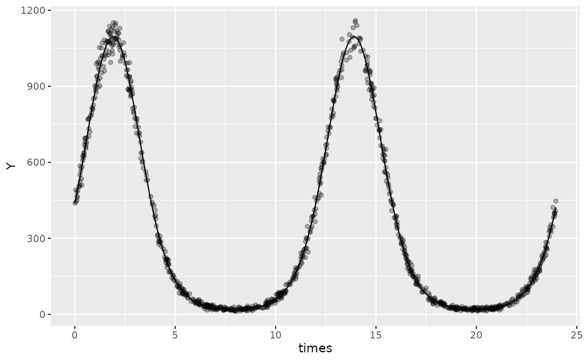
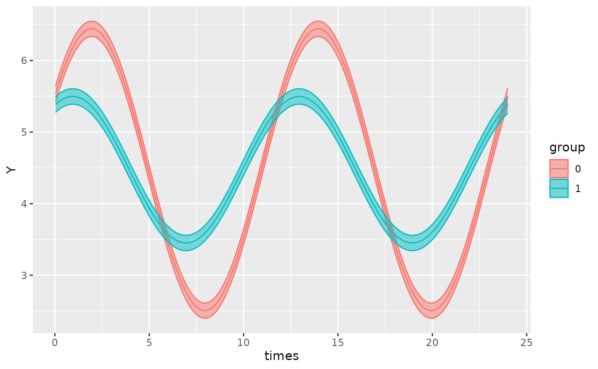
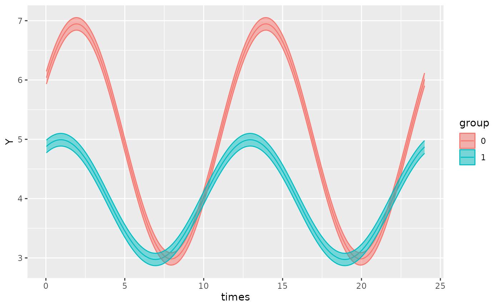

# Model specification

``` r

library(GLMMcosinor)
library(dplyr)
```

## `cglmm()`

[`cglmm()`](https://docs.ropensci.org/GLMMcosinor/reference/cglmm.md)
wrangles the data appropriately to fit the cosinor model given the
formula specified by the user. It provides estimates of amplitude,
acrophase, and MESOR (Midline Statistic Of Rhythm).

The formula argument for
[`cglmm()`](https://docs.ropensci.org/GLMMcosinor/reference/cglmm.md) is
specified using the [lme4](https://github.com/lme4/lme4/) style (for
details see
[`vignette("lmer", package = "lme4")`](https://cran.rstudio.com/web/packages/lme4/vignettes/lmer.pdf)).
The only difference is that it allows for use of an
[`amp_acro()`](https://docs.ropensci.org/GLMMcosinor/reference/amp_acro.md)
call within the formula that is used to identify the circadian
components and relevant variables in the `data.frame`. Any other
combination of covariates can also be included in the formula as well as
random effects and zero-inflation (`ziformula`) and dispersion
(`dispformula`) formulae. For detailed examples of how to specify
models, see the
[mixed-models](https://docs.ropensci.org/GLMMcosinor/articles/mixed-models.html),
[model-specification](https://docs.ropensci.org/GLMMcosinor/articles/model-specification.html)
and
[multiple-components](https://docs.ropensci.org/GLMMcosinor/articles/multiple-components.html)
vignettes.

## Using cglmm()

The following examples use data simulated by the the `simulate_cosinor`
function.

### Specifying a single-component model with no grouping variable

Here, we fit a simple cosinor model to “testdata_simple” - simulated
data from a Poisson distribution loaded in this vignette. In this
example, there is no grouping variable.

``` r

testdata_simple <- simulate_cosinor(
  1000,
  n_period = 2,
  mesor = 5,
  amp = 2,
  acro = 1,
  beta.mesor = 4,
  beta.amp = 1,
  beta.acro = 0.5,
  family = "poisson",
  period = c(12),
  n_components = 1,
  beta.group = TRUE
)
```

``` r

object <- cglmm(
  Y ~ amp_acro(times,
    period = 12
  ),
  data = filter(testdata_simple, group == 0),
  family = poisson()
)
object
#> 
#>  Conditional Model 
#> 
#>  Raw formula: 
#> Y ~ main_rrr1 + main_sss1 
#> 
#>  Raw Coefficients: 
#>             Estimate
#> (Intercept)  4.99845
#> main_rrr1    1.08228
#> main_sss1    1.68235
#> 
#>  Transformed Coefficients: 
#>             Estimate
#> (Intercept)  4.99845
#> amp          2.00041
#> acr          0.99913
```

The output shows the estimates for the raw coefficients in addition to
the transformed estimates for amplitude (amp) and acrophase (acr) and
MESOR (`(Intercept)`). The previous section of this vignette: [An
overview of the statistical methods used for parameter
estimation](https://docs.ropensci.org/GLMMcosinor/articles/GLMMcosinor.html#an-overview-of-the-statistical-methods-used-for-parameter-estimation)
outlines the difference between the raw coefficients and the transformed
coefficients.

We would interpret the output as follows:

- `MESOR estimate = 4.99845`

- `Amplitude estimate = 1.08228`

- `Acrophase estimate = 0.99913`

Note that this estimate is in radians to align with conventions. To
interpret this, we can express `0.99913 radians` as a fraction of the
total 2\pi and multiply by the period to get the time when the response
is a maximal. Hence, \frac{0.99913}{2\pi} \times 12 = 1.908 in the units
of the `time_col` column in the original dataframe. This is saying that
the peak response would occur after 1.908 time-units and every 12
time-units after this. We can confirm this by plotting:

``` r

autoplot(object, superimpose.data = TRUE)
```



### Specifying a single-component model with a grouping variable and a shared MESOR

Now, we can add a grouping variable by adding the name of the group in
the
[`amp_acro()`](https://docs.ropensci.org/GLMMcosinor/reference/amp_acro.md)
function:

``` r

testdata_simple_gaussian <- simulate_cosinor(
  1000,
  n_period = 2,
  mesor = 5,
  amp = 2,
  acro = 1,
  beta.mesor = 4,
  beta.amp = 1,
  beta.acro = 0.5,
  family = "gaussian",
  period = c(12),
  n_components = 1,
  beta.group = TRUE
)
```

``` r

object <- cglmm(
  Y ~ amp_acro(times,
    period = 12,
    group = "group"
  ),
  data = testdata_simple_gaussian,
  family = gaussian
)
object
#> 
#>  Conditional Model 
#> 
#>  Raw formula: 
#> Y ~ group:main_rrr1 + group:main_sss1 
#> 
#>  Raw Coefficients: 
#>                  Estimate
#> (Intercept)       4.47411
#> group0:main_rrr1  1.03269
#> group1:main_rrr1  0.90209
#> group0:main_sss1  1.67745
#> group1:main_sss1  0.48497
#> 
#>  Transformed Coefficients: 
#>               Estimate
#> (Intercept)    4.47411
#> [group=0]:amp  1.96984
#> [group=1]:amp  1.02419
#> [group=0]:acr  1.01896
#> [group=1]:acr  0.49328
```

In the example above, the amplitude and phase are being estimated
separately for the two groups but the **intercept term is shared**. This
represents a shared estimate of the MESOR for both groups and is useful
if two groups are known to have a common baseline (or equilibrium
point). Hence, we would interpret the transformed coefficients as
follows:

- The MESOR estimate is 4.47411 for both `group = 0` and `group = 1`.

- The estimates for amplitude and acrophase are with reference to the a
  MESOR estimate of 4.47411

``` r

autoplot(object)
```



However, the groups in this dataset were simulated with two different
MESORs, and so it would be more appropriate to specify an intercept term
in the formula, as this will estimate the MESOR for both `group = 0` and
`group = 1`:

### Specifying a single-component model with a grouping variable and an intercept (MESOR)

Similarly to a normal regression model with
[lme4](https://github.com/lme4/lme4/) or
[glmmTMB](https://github.com/glmmTMB/glmmTMB), we can add a term for the
group in the model so that we can estimate the **difference in MESOR**
between the two groups.

``` r

object <- cglmm(
  Y ~ group + amp_acro(times,
    period = 12,
    group = "group"
  ),
  data = testdata_simple_gaussian,
  family = gaussian()
)
object
#> 
#>  Conditional Model 
#> 
#>  Raw formula: 
#> Y ~ group + group:main_rrr1 + group:main_sss1 
#> 
#>  Raw Coefficients: 
#>                  Estimate
#> (Intercept)       4.96475
#> group1           -0.98130
#> group0:main_rrr1  1.04667
#> group1:main_rrr1  0.88812
#> group0:main_sss1  1.68266
#> group1:main_sss1  0.47976
#> 
#>  Transformed Coefficients: 
#>               Estimate
#> (Intercept)    4.96475
#> [group=1]     -0.98130
#> [group=0]:amp  1.98163
#> [group=1]:amp  1.00942
#> [group=0]:acr  1.01433
#> [group=1]:acr  0.49528
```

This is the same dataset used in the previous example, but note the
following differences:

- The MESOR estimate for the reference group (`group = 0`) is given by
  `(Intercept) = 4.96476`

- The estimate for the difference between the MESOR of the reference
  group (`group = 0`) and the treatment group (`group = 1`) is given by
  `[group=1] = -0.98129`. As such, the estimate for the MESOR of
  `group = 1` is `3.98347`.

- The estimates for amplitude and acrophase are slightly different to
  the previous example because there is no longer a shared MESOR.

Plotting this model and comparing to the previous model which used the
same dataset, one can appreciate the importance of specifying the
formula correctly in order to gain the most accurate model.

``` r

autoplot(object)
```



We may also be interested in estimating the MESOR for the two groups
separately, rather than the difference between groups. To achieve this,
we can remove the intercept term by using `0 +`.

``` r

cglmm(
  Y ~ 0 + group + amp_acro(times,
    period = 12,
    group = "group"
  ),
  data = testdata_simple,
  family = poisson()
)
#> 
#>  Conditional Model 
#> 
#>  Raw formula: 
#> Y ~ group + group:main_rrr1 + group:main_sss1 - 1 
#> 
#>  Raw Coefficients: 
#>                  Estimate
#> group0            4.99845
#> group1            3.99631
#> group0:main_rrr1  1.08228
#> group1:main_rrr1  0.87665
#> group0:main_sss1  1.68235
#> group1:main_sss1  0.48195
#> 
#>  Transformed Coefficients: 
#>               Estimate
#> [group=0]      4.99845
#> [group=1]      3.99631
#> [group=0]:amp  2.00041
#> [group=1]:amp  1.00040
#> [group=0]:acr  0.99913
#> [group=1]:acr  0.50266
```

### Specifying more complicated models using the `amp_acro()` function

The
[`amp_acro()`](https://docs.ropensci.org/GLMMcosinor/reference/amp_acro.md)
function controls the cosinor components of model (specifically, this
affects just the fixed-effects part). It provides the user with the
ability to specify grouping structures, the period of the rhythm, and
the number of components. There are several arguments that the user must
specify:

- `group` is the name of the grouping variable in the dataset. This can
  be a string or an object

- `time_col` is the name of the time column in the dataset. This can be
  a string or an object

- `n_components` is the number of components.

If the user wishes to fit a multicomponent cosinor model, they can
specify the number of components using the `n_components` variable. The
value of `n_components` will need to match the length of the `group` and
`period` arguments as these will be combined for each component.

For example:

``` r

testdata_two_components <- simulate_cosinor(
  1000,
  n_period = 10,
  mesor = 7,
  amp = c(0.1, 0.4),
  acro = c(1, 1.5),
  beta.mesor = 4.4,
  beta.amp = c(2, 1),
  beta.acro = c(1, -1.5),
  family = "poisson",
  period = c(12, 6),
  n_components = 2,
  beta.group = TRUE
)
```

``` r

cglmm(
  Y ~ group + amp_acro(
    time_col = times,
    n_components = 2,
    period = c(12, 6),
    group = c("group", "group")
  ),
  data = testdata_two_components,
  family = poisson()
)
#> 
#>  Conditional Model 
#> 
#>  Raw formula: 
#> Y ~ group + group:main_rrr1 + group:main_sss1 + group:main_rrr2 +      group:main_sss2 
#> 
#>  Raw Coefficients: 
#>                  Estimate
#> (Intercept)       7.00043
#> group1           -2.60739
#> group0:main_rrr1  0.05665
#> group1:main_rrr1  1.08270
#> group0:main_sss1  0.08378
#> group1:main_sss1  1.68926
#> group0:main_rrr2  0.02884
#> group1:main_rrr2  0.07367
#> group0:main_sss2  0.39671
#> group1:main_sss2 -0.99891
#> 
#>  Transformed Coefficients: 
#>                Estimate
#> (Intercept)     7.00043
#> [group=1]      -2.60739
#> [group=0]:amp1  0.10113
#> [group=1]:amp1  2.00645
#> [group=0]:amp2  0.39776
#> [group=1]:amp2  1.00162
#> [group=0]:acr1  0.97624
#> [group=1]:acr1  1.00082
#> [group=0]:acr2  1.49824
#> [group=1]:acr2 -1.49717
```

In the output, the suffix on the estimates for amplitude and acrophase
represents its component:

- `[group=0]:amp1 = 0.10113` represents the estimate for amplitude of
  `group 0` for the first component

- `[group=1]:amp1 = 2.00645` represents the estimate for amplitude of
  `group 1` for the first component

- `[group=0]:amp2 = 0.39776` represents the estimate for amplitude of
  `group 0` for the second component

- `[group=1]:amp2 = 1.00162` represents the estimate for amplitude of
  `group 1` for the second component

- *Similarly for acrophase estimates*

If a multicomponent model has one component that is grouped with other
components that aren’t, the vector input for `group` must still be the
same length as `n_components` but have the non-grouped components
represented as `group = NA`.

For example, if we wanted only the first component to have a grouped
component, we would specify the `group` argument as
`group = c("group", NA))`.

For a detailed explanation of how to specify multi-component models, see
[multiple-components](https://docs.ropensci.org/GLMMcosinor/articles/multiple-components.html)

### Dispersion and zero-inflation model specification

The
[`cglmm()`](https://docs.ropensci.org/GLMMcosinor/reference/cglmm.md)
function allows users to specify formulas for dispersion and
zero-inflation models. These formulas are independent of the main
formula specification:

``` r

testdata_disp_zi <- simulate_cosinor(1000,
  n_period = 6,
  mesor = 7,
  amp = c(0.1, 0.4, 0.5),
  acro = c(1, 1.5, 0.1),
  beta.mesor = 4.4,
  beta.amp = c(2, 1, 0.4),
  beta.acro = c(1, -1.5, -1),
  family = "gaussian",
  period = c(12, 6, 8),
  n_components = 3
)
object_disp_zi <- cglmm(
  Y ~ group + amp_acro(times,
    n_components = 3,
    period = c(12, 6, 8),
    group = "group"
  ),
  data = testdata_disp_zi, family = gaussian(),
  dispformula = ~ group + amp_acro(times,
    n_components = 2,
    group = "group",
    period = c(12, 6)
  ),
  ziformula = ~ group + amp_acro(times,
    n_components = 3,
    group = "group",
    period = c(7, 8, 2)
  )
)

object_disp_zi
#> 
#>  Conditional Model 
#> 
#>  Raw formula: 
#> Y ~ group + group:main_rrr1 + group:main_sss1 + group:main_rrr2 +      group:main_sss2 + group:main_rrr3 + group:main_sss3 
#> 
#>  Raw Coefficients: 
#>                  Estimate
#> (Intercept)       6.95937
#> group1           -2.54022
#> group0:main_rrr1  0.04699
#> group1:main_rrr1  1.08129
#> group0:main_sss1  0.11911
#> group1:main_sss1  1.65334
#> group0:main_rrr2  0.03439
#> group1:main_rrr2  0.03916
#> group0:main_sss2  0.36981
#> group1:main_sss2 -0.97296
#> group0:main_rrr3  0.50496
#> group1:main_rrr3  0.20937
#> group0:main_sss3  0.11201
#> group1:main_sss3 -0.34949
#> 
#>  Transformed Coefficients: 
#>                Estimate
#> (Intercept)     6.95937
#> [group=1]      -2.54022
#> [group=0]:amp1  0.12804
#> [group=1]:amp1  1.97553
#> [group=0]:amp2  0.37141
#> [group=1]:amp2  0.97374
#> [group=0]:amp3  0.51723
#> [group=1]:amp3  0.40740
#> [group=0]:acr1  1.19503
#> [group=1]:acr1  0.99161
#> [group=0]:acr2  1.47806
#> [group=1]:acr2 -1.53057
#> [group=0]:acr3  0.21828
#> [group=1]:acr3 -1.03106
#> 
#> ***********************
#> 
#>  Dispersion Model 
#> 
#>  Raw  Formula: 
#> ~group + group:disp_rrr1 + group:disp_sss1 + group:disp_rrr2 +      group:disp_sss2 
#> 
#>  Raw  Coefficients: 
#>                  Estimate
#> (Intercept)      -0.03473
#> group1            0.00801
#> group0:disp_rrr1 -0.06511
#> group1:disp_rrr1  0.01818
#> group0:disp_sss1  0.04175
#> group1:disp_sss1  0.00363
#> group0:disp_rrr2  0.00043
#> group1:disp_rrr2  0.02406
#> group0:disp_sss2  0.03210
#> group1:disp_sss2  0.01321
#> 
#>  Transformed  Coefficients: 
#>                Estimate
#> (Intercept)    -0.03473
#> [group=1]       0.00801
#> [group=0]:amp1  0.07735
#> [group=1]:amp1  0.01854
#> [group=0]:amp2  0.03210
#> [group=1]:amp2  0.02745
#> [group=0]:acr1  2.57140
#> [group=1]:acr1  0.19696
#> [group=0]:acr2  1.55747
#> [group=1]:acr2  0.50200
#> 
#> ***********************
#> 
#>  Zero-Inflation Model 
#> 
#>  Raw  Formula: 
#> ~group + group:zi_rrr1 + group:zi_sss1 + group:zi_rrr2 + group:zi_sss2 +      group:zi_rrr3 + group:zi_sss3 
#> 
#>  Raw  Coefficients: 
#>                 Estimate
#> (Intercept)    -22.61497
#> group1          -1.97987
#> group0:zi_rrr1  -0.02438
#> group1:zi_rrr1  -0.01345
#> group0:zi_sss1   0.01174
#> group1:zi_sss1   0.00734
#> group0:zi_rrr2   0.00696
#> group1:zi_rrr2   0.00261
#> group0:zi_sss2   0.06002
#> group1:zi_sss2   0.03091
#> group0:zi_rrr3   0.00287
#> group1:zi_rrr3   0.00171
#> group0:zi_sss3   0.02897
#> group1:zi_sss3   0.01413
#> 
#>  Transformed  Coefficients: 
#>                 Estimate
#> (Intercept)    -22.61497
#> [group=1]       -1.97987
#> [group=0]:amp1   0.02706
#> [group=1]:amp1   0.01532
#> [group=0]:amp2   0.06043
#> [group=1]:amp2   0.03102
#> [group=0]:amp3   0.02911
#> [group=1]:amp3   0.01423
#> [group=0]:acr1   2.69272
#> [group=1]:acr1   2.64200
#> [group=0]:acr2   1.45542
#> [group=1]:acr2   1.48647
#> [group=0]:acr3   1.47202
#> [group=1]:acr3   1.45027
```

The output provides estimates for conditional model (default model), the
dispersion model, and also the zero-inflation model. By default,
`dispformula = ~1`, and `ziformula = ~0` which means these additional
models will not be generated in the output.

*Note that in the example above, the value for the periods and the
number of components in the dispersion and zero-inflation formulas were
chosen arbitrarily and purely for demonstration.*

## Using `summary(cglmm)`

The [`summary()`](https://rdrr.io/r/base/summary.html) method for
`cglmm` objects provides a more detailed summary of the model and its
parameter estimates and uncertainty. It outputs the estimates, standard
errors, confidence intervals, and p-values for both the raw model
parameters and the transformed parameters. The summary statistics do not
represent a comparison between any groups for the cosinor components -
that is the role of the `test_cosinor()` function.

Here is an example of how to use
[`summary()`](https://rdrr.io/r/base/summary.html):

``` r

object <- cglmm(
  Y ~ group + amp_acro(times,
    period = 12,
    group = "group"
  ),
  data = testdata_simple,
  family = poisson()
)
summary(object)
#> 
#>  Conditional Model 
#> Raw model coefficients:
#>                      estimate standard.error     lower.CI upper.CI    p.value
#> (Intercept)       4.998454142    0.003463730  4.991665356  5.00524 < 2.22e-16
#> group1           -1.002150000    0.005937109 -1.013786521 -0.99051 < 2.22e-16
#> group0:main_rrr1  1.082281784    0.003347565  1.075720677  1.08884 < 2.22e-16
#> group1:main_rrr1  0.876651963    0.006198710  0.864502714  0.88880 < 2.22e-16
#> group0:main_sss1  1.682350718    0.003919418  1.674668800  1.69003 < 2.22e-16
#> group1:main_sss1  0.481951763    0.005936670  0.470316104  0.49359 < 2.22e-16
#>                     
#> (Intercept)      ***
#> group1           ***
#> group0:main_rrr1 ***
#> group1:main_rrr1 ***
#> group0:main_sss1 ***
#> group1:main_sss1 ***
#> ---
#> Signif. codes:  0 '***' 0.001 '**' 0.01 '*' 0.05 '.' 0.1 ' ' 1
#> 
#> Transformed coefficients:
#>                    estimate standard.error     lower.CI upper.CI    p.value    
#> (Intercept)     4.998454142    0.003463730  4.991665356  5.00524 < 2.22e-16 ***
#> [group=1]      -1.002150000    0.005937109 -1.013786521 -0.99051 < 2.22e-16 ***
#> [group=0]:amp1  2.000409408    0.004275553  1.992029478  2.00879 < 2.22e-16 ***
#> [group=1]:amp1  1.000398004    0.006379631  0.987894156  1.01290 < 2.22e-16 ***
#> [group=0]:acr1  0.999134804    0.001439122  0.996314177  1.00196 < 2.22e-16 ***
#> [group=1]:acr1  0.502662067    0.005739524  0.491412807  0.51391 < 2.22e-16 ***
#> ---
#> Signif. codes:  0 '***' 0.001 '**' 0.01 '*' 0.05 '.' 0.1 ' ' 1
```

The summary statistics for dispersion and zero-inflation models will
also be provided by the
[`summary()`](https://rdrr.io/r/base/summary.html) function, if the
original `cglmm` object being analyzed contains them. The following
demonstration uses the model specified in the **Dispersion and
Zero-inflation model specification** section of this vignette:

``` r

summary(object_disp_zi)
#> 
#>  Conditional Model 
#> Raw model coefficients:
#>                     estimate standard.error    lower.CI upper.CI    p.value    
#> (Intercept)       6.95936556     0.03071385  6.89916751  7.01956 < 2.22e-16 ***
#> group1           -2.54021503     0.04358865 -2.62564722 -2.45478 < 2.22e-16 ***
#> group0:main_rrr1  0.04698858     0.04402198 -0.03929291  0.13327  0.2857961    
#> group1:main_rrr1  1.08128690     0.04468795  0.99370014  1.16887 < 2.22e-16 ***
#> group0:main_sss1  0.11910542     0.04289629  0.03503024  0.20318  0.0054932 ** 
#> group1:main_sss1  1.65334381     0.04260766  1.56983433  1.73685 < 2.22e-16 ***
#> group0:main_rrr2  0.03439409     0.04311049 -0.05010091  0.11889  0.4249792    
#> group1:main_rrr2  0.03916104     0.04350031 -0.04609799  0.12442  0.3679885    
#> group0:main_sss2  0.36981389     0.04381153  0.28394487  0.45568 < 2.22e-16 ***
#> group1:main_sss2 -0.97295612     0.04406664 -1.05932515 -0.88659 < 2.22e-16 ***
#> group0:main_rrr3  0.50495760     0.04353423  0.41963208  0.59028 < 2.22e-16 ***
#> group1:main_rrr3  0.20936933     0.04406129  0.12301078  0.29573 2.0164e-06 ***
#> group0:main_sss3  0.11200822     0.04318471  0.02736774  0.19665  0.0094949 ** 
#> group1:main_sss3 -0.34948713     0.04362987 -0.43500011 -0.26397 1.1446e-15 ***
#> ---
#> Signif. codes:  0 '***' 0.001 '**' 0.01 '*' 0.05 '.' 0.1 ' ' 1
#> 
#> Transformed coefficients:
#>                   estimate standard.error    lower.CI upper.CI    p.value    
#> (Intercept)     6.95936556     0.03071385  6.89916751  7.01956 < 2.22e-16 ***
#> [group=1]      -2.54021503     0.04358865 -2.62564722 -2.45478 < 2.22e-16 ***
#> [group=0]:amp1  0.12803917     0.04327900  0.04321389  0.21286 0.00309181 ** 
#> [group=1]:amp1  1.97553211     0.04320207  1.89085760  2.06021 < 2.22e-16 ***
#> [group=0]:amp2  0.37140983     0.04374249  0.28567612  0.45714 < 2.22e-16 ***
#> [group=1]:amp2  0.97374391     0.04409110  0.88732694  1.06016 < 2.22e-16 ***
#> [group=0]:amp3  0.51723111     0.04359488  0.43178673  0.60268 < 2.22e-16 ***
#> [group=1]:amp3  0.40740247     0.04352925  0.32208670  0.49272 < 2.22e-16 ***
#> [group=0]:acr1  1.19502944     0.34087836  0.52692014  1.86314 0.00045535 ***
#> [group=1]:acr1  0.99161427     0.02232997  0.94784834  1.03538 < 2.22e-16 ***
#> [group=0]:acr2  1.47805931     0.11626115  1.25019163  1.70593 < 2.22e-16 ***
#> [group=1]:acr2 -1.53056849     0.04464779 -1.61807656 -1.44306 < 2.22e-16 ***
#> [group=0]:acr3  0.21828283     0.08337374  0.05487331  0.38169 0.00884145 ** 
#> [group=1]:acr3 -1.03105656     0.10839576 -1.24350836 -0.81860 < 2.22e-16 ***
#> ---
#> Signif. codes:  0 '***' 0.001 '**' 0.01 '*' 0.05 '.' 0.1 ' ' 1
#> 
#> ***********************
#> 
#>  Dispersion Model 
#> Raw model coefficients:
#>                       estimate standard.error      lower.CI upper.CI  p.value  
#> (Intercept)      -0.0347280897   0.0224035316 -0.0786382047  0.00918 0.121113  
#> group1            0.0080078590   0.0316841823 -0.0540919971  0.07011 0.800469  
#> group0:disp_rrr1 -0.0651097291   0.0321127818 -0.1280496248 -0.00217 0.042608 *
#> group1:disp_rrr1  0.0181780943   0.0321136581 -0.0447635189  0.08112 0.571356  
#> group0:disp_sss1  0.0417508297   0.0315078493 -0.0200034201  0.10351 0.185140  
#> group1:disp_sss1  0.0036273726   0.0313981878 -0.0579119447  0.06517 0.908027  
#> group0:disp_rrr2  0.0004278478   0.0314578474 -0.0612284001  0.06208 0.989149  
#> group1:disp_rrr2  0.0240620523   0.0313904831 -0.0374621641  0.08559 0.443355  
#> group0:disp_sss2  0.0320974928   0.0322015725 -0.0310164296  0.09521 0.318877  
#> group1:disp_sss2  0.0132077971   0.0322128867 -0.0499283007  0.07634 0.681794  
#> ---
#> Signif. codes:  0 '***' 0.001 '**' 0.01 '*' 0.05 '.' 0.1 ' ' 1
#> 
#> Transformed coefficients:
#>                    estimate standard.error     lower.CI upper.CI    p.value    
#> (Intercept)    -0.034728090    0.022403532 -0.078638205  0.00918   0.121113    
#> [group=1]       0.008007859    0.031684182 -0.054091997  0.07011   0.800469    
#> [group=0]:amp1  0.077346032    0.032142219  0.014348440  0.14034   0.016112 *  
#> [group=1]:amp1  0.018536476    0.031999981 -0.044182334  0.08126   0.562410    
#> [group=0]:amp2  0.032100344    0.032186663 -0.030984357  0.09519   0.318610    
#> [group=1]:amp2  0.027448648    0.031351222 -0.033998619  0.08890   0.381291    
#> [group=0]:acr1  2.571401723    0.406973936  1.773747465  3.36906 2.6438e-10 ***
#> [group=1]:acr1  0.196959330    1.700109341 -3.135193749  3.52911   0.907771    
#> [group=0]:acr2  1.557467483    0.980459948 -0.364198703  3.47913   0.112172    
#> [group=1]:acr2  0.502002651    1.174961294 -1.800879168  2.80488   0.669197    
#> ---
#> Signif. codes:  0 '***' 0.001 '**' 0.01 '*' 0.05 '.' 0.1 ' ' 1
#> 
#> ***********************
#> 
#>  Zero-Inflation Model 
#> Raw model coefficients:
#>                     estimate standard.error      lower.CI  upper.CI p.value
#> (Intercept)    -2.261497e+01   2.577867e+03 -5.075141e+03  5029.911 0.99300
#> group1         -1.979874e+00   7.402772e+03 -1.451115e+04 14507.187 0.99979
#> group0:zi_rrr1 -2.437951e-02   3.767691e+03 -7.384563e+03  7384.515 0.99999
#> group1:zi_rrr1 -1.344566e-02   1.013043e+04 -1.985529e+04 19855.266 1.00000
#> group0:zi_sss1  1.174286e-02   3.723977e+03 -7.298849e+03  7298.873 1.00000
#> group1:zi_sss1  7.338272e-03   1.002278e+04 -1.964428e+04 19644.299 1.00000
#> group0:zi_rrr2  6.956552e-03   3.756730e+03 -7.363048e+03  7363.062 1.00000
#> group1:zi_rrr2  2.612567e-03   1.009963e+04 -1.979491e+04 19794.912 1.00000
#> group0:zi_sss2  6.002497e-02   3.733229e+03 -7.316935e+03  7317.055 0.99999
#> group1:zi_sss2  3.090808e-02   1.005079e+04 -1.969916e+04 19699.225 1.00000
#> group0:zi_rrr3  2.870614e-03   3.613030e+03 -7.081405e+03  7081.411 1.00000
#> group1:zi_rrr3  1.710953e-03   9.717375e+03 -1.904570e+04 19045.707 1.00000
#> group0:zi_sss3  2.896578e-02   3.697094e+03 -7.246143e+03  7246.201 0.99999
#> group1:zi_sss3  1.412696e-02   9.949658e+03 -1.950096e+04 19500.985 1.00000
#> 
#> Transformed coefficients:
#>                     estimate standard.error      lower.CI    upper.CI p.value
#> (Intercept)    -2.261497e+01   2.577867e+03 -5.075141e+03    5029.911 0.99300
#> [group=1]      -1.979874e+00   7.402772e+03 -1.451115e+04   14507.187 0.99979
#> [group=0]:amp1  2.706022e-02   3.836285e+03 -7.518953e+03    7519.007 0.99999
#> [group=1]:amp1  1.531783e-02   1.032999e+04 -2.024638e+04   20246.415 1.00000
#> [group=0]:amp2  6.042674e-02   3.733004e+03 -7.316493e+03    7316.614 0.99999
#> [group=1]:amp2  3.101830e-02   1.004989e+04 -1.969739e+04   19697.451 1.00000
#> [group=0]:amp3  2.910768e-02   3.703759e+03 -7.259205e+03    7259.263 0.99999
#> [group=1]:amp3  1.423019e-02   9.971908e+03 -1.954457e+04   19544.595 1.00000
#> [group=0]:acr1  2.692717e+00   1.350054e+05 -2.646030e+05  264608.403 0.99998
#> [group=1]:acr1  2.642001e+00   6.408861e+05 -1.256111e+06 1256116.362 1.00000
#> [group=0]:acr2  1.455417e+00   6.217369e+04 -1.218567e+05  121859.649 0.99998
#> [group=1]:acr2  1.486470e+00   3.256313e+05 -6.382242e+05  638227.184 1.00000
#> [group=0]:acr3  1.472015e+00   1.238916e+05 -2.428216e+05  242824.575 0.99999
#> [group=1]:acr3  1.450271e+00   6.812655e+05 -1.335254e+06 1335257.213 1.00000
```

*Note that this dataset was not simulated with consideration of
dispersion or zero-inflation characteristics, hence the lack of
significant P-values in the model summary for the dispersion and
zero-inflation models.*
