# Visualizing models

## Visualizing `cglmm` models

The `GLMMcosinor` package includes two ways to visualize models from
[`cglmm()`](https://docs.ropensci.org/GLMMcosinor/reference/cglmm.md).
Firstly, the function
[`autoplot()`](https://ggplot2.tidyverse.org/reference/autoplot.html)
creates a time-response plot of the fitted model:

``` r

library(GLMMcosinor)

object <- cglmm(
  vit_d ~ X + amp_acro(time,
    group = "X",
    period = 12
  ),
  data = vitamind
)
autoplot(object, x_str = "X")
```

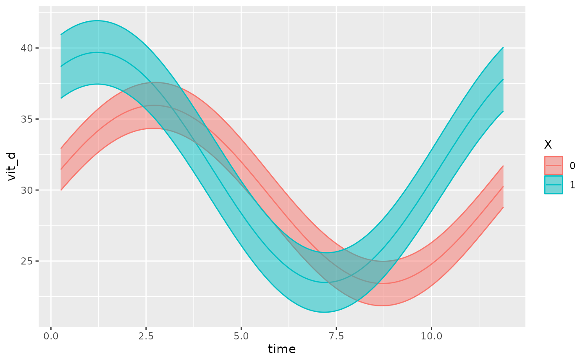

This function also allows users to superimpose the data points (that the
fit is based on) over the fitted model, using the
`superimpose.data = TRUE` argument:

``` r

object <- cglmm(
  vit_d ~ X + amp_acro(time,
    group = "X",
    period = 12
  ),
  data = vitamind
)
autoplot(object, x_str = "X", superimpose.data = TRUE)
```

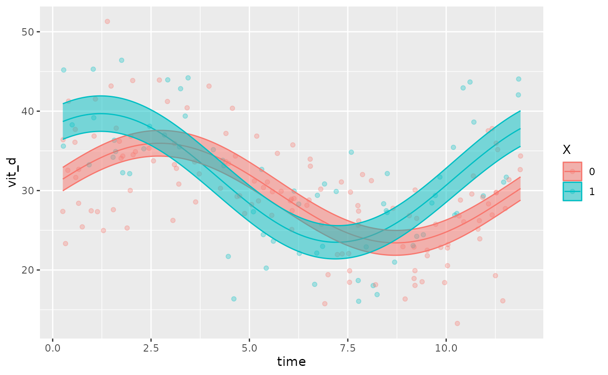

If there are multiple factors in the model, the user can specify which
covariate to be plotted using the `x_str` argument which accepts a
string corresponding to a group name within the original dataset. By
default, `x_str = NULL` and the intercept is plotted (all
`group levels = 0`).

The following examples demonstrate how `x_str` can be used to produce
different plots for the same model. Note how `predict.ribbon` can be set
to `FALSE` to remove the prediction interval from the plots.

``` r

testdata_two_components <- testdata_two_components
testdata_two_components$X <- rbinom(length(testdata_two_components$group),
  2,
  prob = 0.5
)
object <- cglmm(
  Y ~ group + amp_acro(times,
    n_components = 2,
    period = c(12, 6),
    group = c("group", "X")
  ),
  data = testdata_two_components,
  family = poisson()
)
autoplot(object, predict.ribbon = FALSE)
```

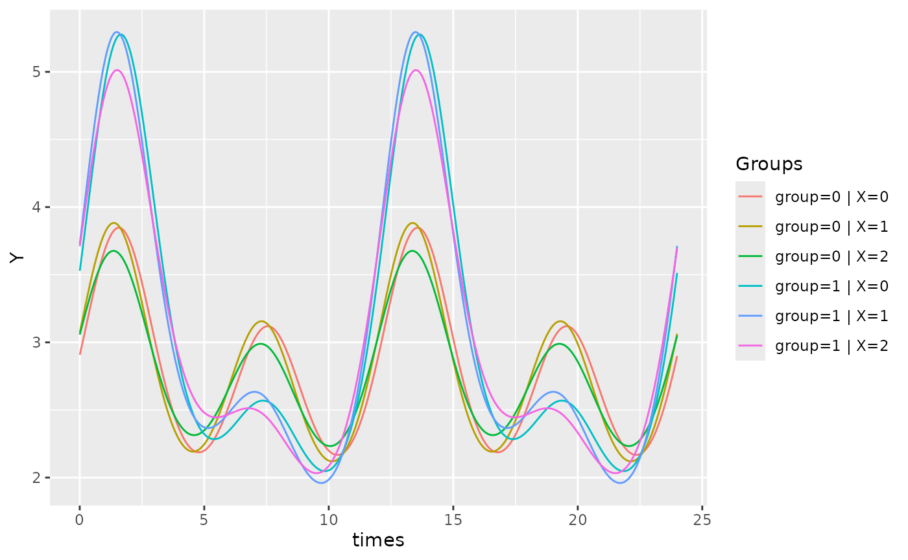

``` r

object <- cglmm(
  Y ~ group + amp_acro(times,
    n_components = 2,
    period = c(12, 6),
    group = c("group", "X")
  ),
  data = testdata_two_components,
  family = poisson()
)
autoplot(object, x_str = "X", predict.ribbon = FALSE)
```

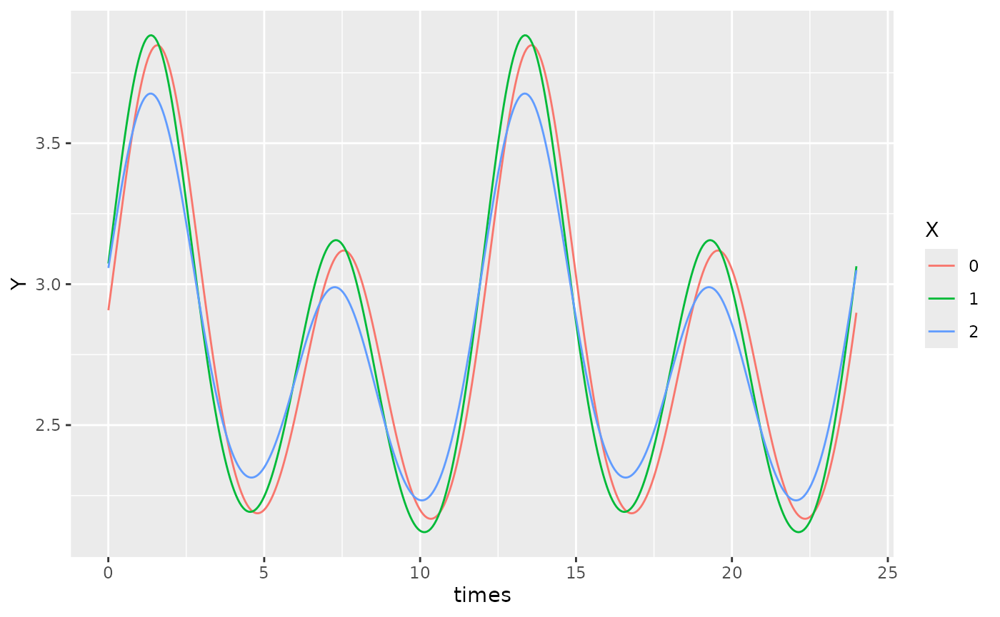

``` r

object <- cglmm(
  Y ~ group + amp_acro(times,
    n_components = 2,
    period = c(12, 6),
    group = c("group", "X")
  ),
  data = testdata_two_components,
  family = poisson()
)
autoplot(object, x_str = "group", predict.ribbon = FALSE)
```

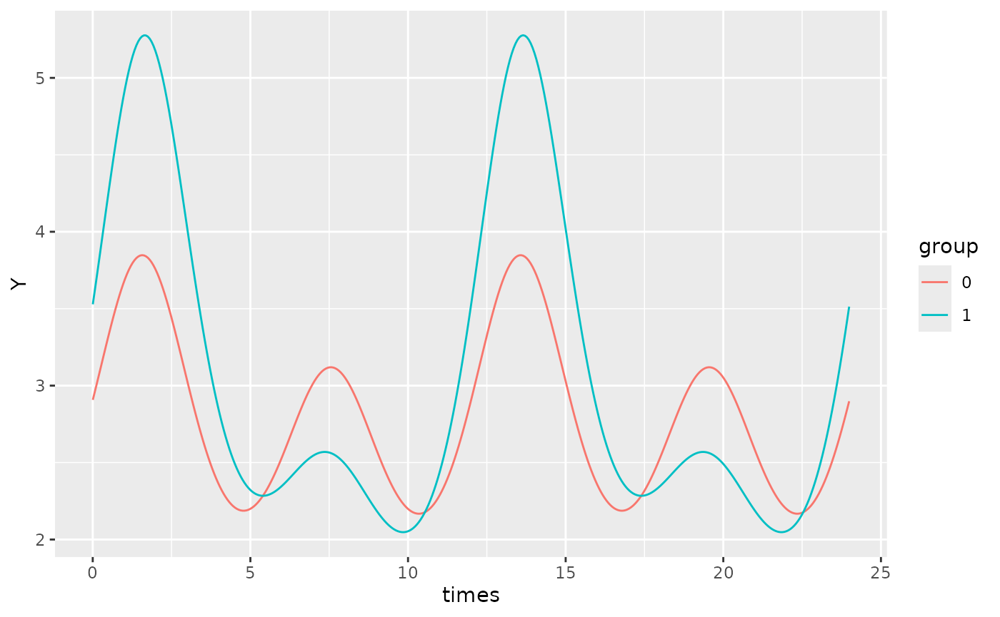

By default, `xmin` will be set to the minimum time value in the time
vector of the original dataframe, and `xmax` will be set to the maximum
time value. If we want to focus on a specific region of the plot, we can
define use the `xlims` argument to specify the x-bounds.

For example, on the plot above, we can adjust the x-limits:

``` r

object <- cglmm(
  Y ~ group + amp_acro(times,
    n_components = 2,
    period = c(12, 6),
    group = c("group", "X")
  ),
  data = testdata_two_components,
  family = poisson()
)
autoplot(object, x_str = "group", predict.ribbon = TRUE, xlims = c(13, 15))
```

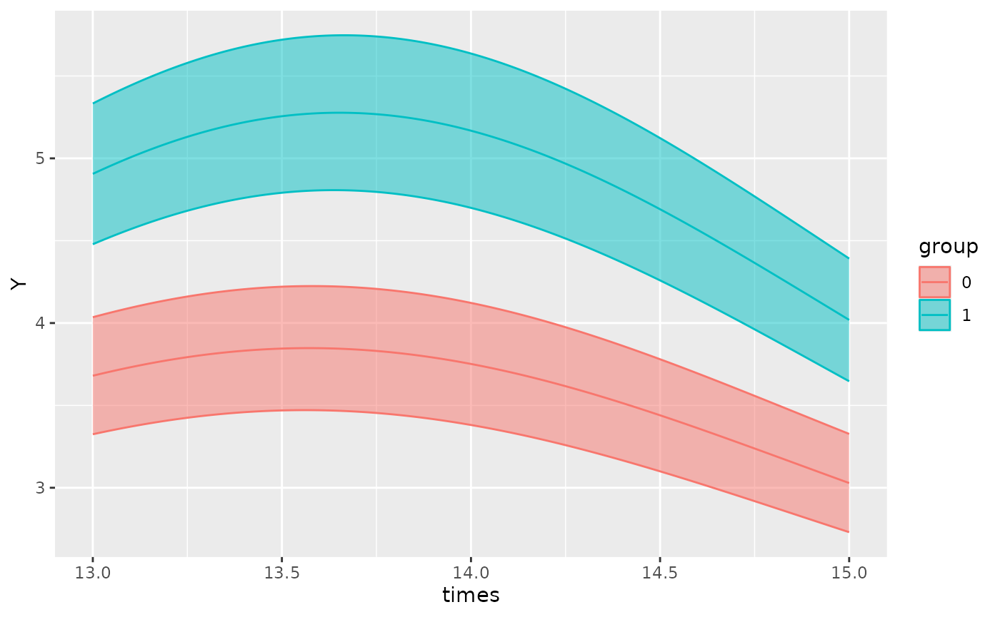

To increase the resolution of the plots, the `pred.length.out` can be
increased. If there are multiple periods, the function will
automatically generate an appropriate number of points to plot such that
the smallest period has sufficient resolution to appreciate cosinor
behaviour. This can be adjusted using the `points_per_min_cycle_length`
argument which is 20 by default.

``` r

testdata_period_diff <- simulate_cosinor(
  1000,
  n_period = 1,
  mesor = 7,
  amp = c(0.1, 0.4),
  acro = c(1, 1.5),
  family = "poisson",
  period = c(12, 1000),
  n_components = 2
)
```

``` r

object <- cglmm(
  Y ~ amp_acro(times,
    n_components = 2,
    period = c(12, 1000)
  ),
  data = testdata_period_diff,
  family = poisson()
)

autoplot(object, points_per_min_cycle_length = 40)
```

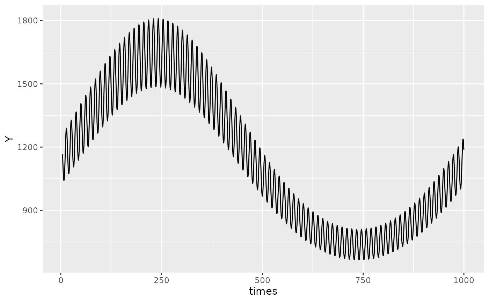

## Polar plots

In addition to time-response plots, the `GLMMcosinor` package also
allows users to create polar plots. In these plots, the plotted point
represents the acrophase estimate, and the radius represents the
amplitude estimate for a given component or group. The ellipses
represent confidence regions.

------------------------------------------------------------------------

``` r

model <- cglmm(
  vit_d ~ X + amp_acro(time,
    group = "X",
    period = 12
  ),
  data = vitamind
)
polar_plot(model)
```


There is in built method to directly assess differential rhythmicity,
the overall difference between two rhythms in terms of both amplitude
and phase combined. It can be done using a likelihood ratio and is
demonstrated as part of the [Getting
started](https://docs.ropensci.org/GLMMcosinor/articles/GLMMcosinor.html)
vignette. It can also be assessed by visually inspecting the
[`polar_plot()`](https://docs.ropensci.org/GLMMcosinor/reference/polar_plot.md)
and seeing whether the ellipses exclude each others poles. For example,
in the plot above, both ellipses exclude the center point (black dot) of
the other ellipses. These two rhythms differ primarily by their phase,
and not their amplitude, but this visual assessment determines that
there statistically significant (p\<0.05 since these are 95% confidence
regions) differences in their overall rhythmicity. To estimate the
differences in the rhythmic parameters (amplitude and phase)
individually, see the usage of
[`test_cosinor_levels()`](https://docs.ropensci.org/GLMMcosinor/reference/test_cosinor_levels.md)
or
[`test_cosinor_components()`](https://docs.ropensci.org/GLMMcosinor/reference/test_cosinor_components.md).

The angle units in the plot can be specified with the `radial_units`
argument. By default, the units are in radians where a complete
revolution of the plot (2\pi) represents the maximum period from the
model. The units can be changed to degrees, or even to be expressed in
the same units as the period specification.

``` r

model <- cglmm(
  vit_d ~ X + amp_acro(time,
    group = "X",
    period = 12
  ),
  data = vitamind
)
polar_plot(model, radial_units = "degrees")
```

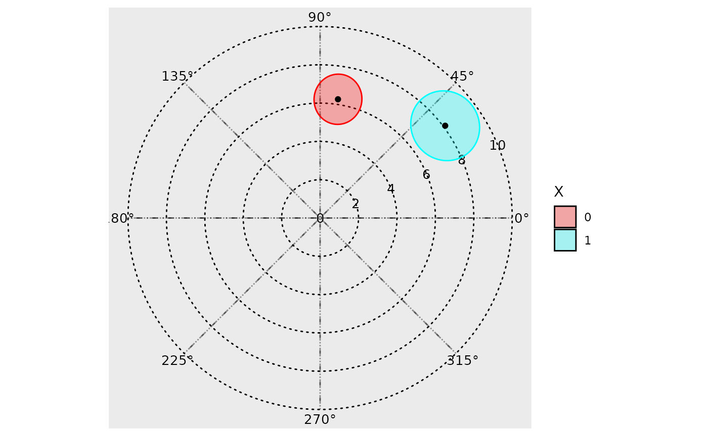

By default, the function creates creates polar plots for all components
and stitches them together using the `make_cowplot = TRUE` argument. If
the user wishes to plot just one component, they can specify this by
using `component_index`, though the `make_cowplot` argument must be
`FALSE` for this to register.

The direction that the angle increases in can be changed with the
clockwise argument, and the location of the angle = 0 starting point can
be specified with the `start` argument. Hence, if the user wishes to
create a polar plot that resembles a clock, this can be done by
specifying `clockwise = TRUE` and `start = "top"`.

The argument: `overlay_parameter_info` can be used to create a line
extending from the origin to the parameter estimate (to visualize the
amplitude estimate), and a circular arc extending from the angle
starting position (at 0) to the acrophase estimate.

``` r

model <- cglmm(
  vit_d ~ X + amp_acro(time,
    group = "X",
    period = 12
  ),
  data = vitamind
)
polar_plot(model, overlay_parameter_info = TRUE)
```

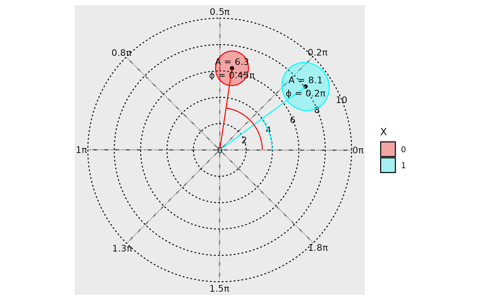

The background grid can also be customized. The argument
`grid_angle_segments` is used to specify how many sectors the polar grid
has, and the `n_breaks` argument can be used to specify the number of
concentric circles.

``` r

model <- cglmm(
  vit_d ~ X + amp_acro(time,
    group = "X",
    period = 12
  ),
  data = vitamind
)
polar_plot(model,
  grid_angle_segments = 12,
  clockwise = TRUE,
  start = "top",
  n_breaks = 5
)
```

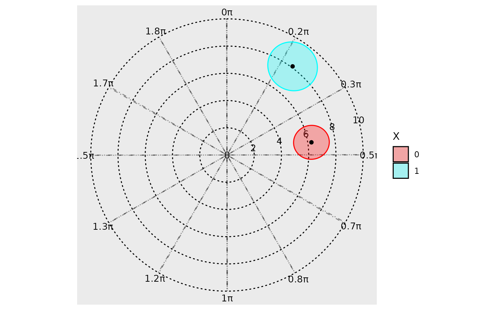

If the user wishes to zoom into the confidence ellipses to show relevant
information, they can adjust the view from the default `full` (which
plots a full view of the polar plot) to `zoom` (which enlarges the
smallest view window containing all confidence ellipses), or
`zoom_origin` (which enlarges the smallest view window containing all
confidence ellipses AND the origin).

``` r

model <- cglmm(
  vit_d ~ X + amp_acro(time,
    group = "X",
    period = 12
  ),
  data = vitamind
)
polar_plot(model,
  grid_angle_segments = 12,
  clockwise = TRUE,
  start = "top",
  view = "zoom_origin"
)
```

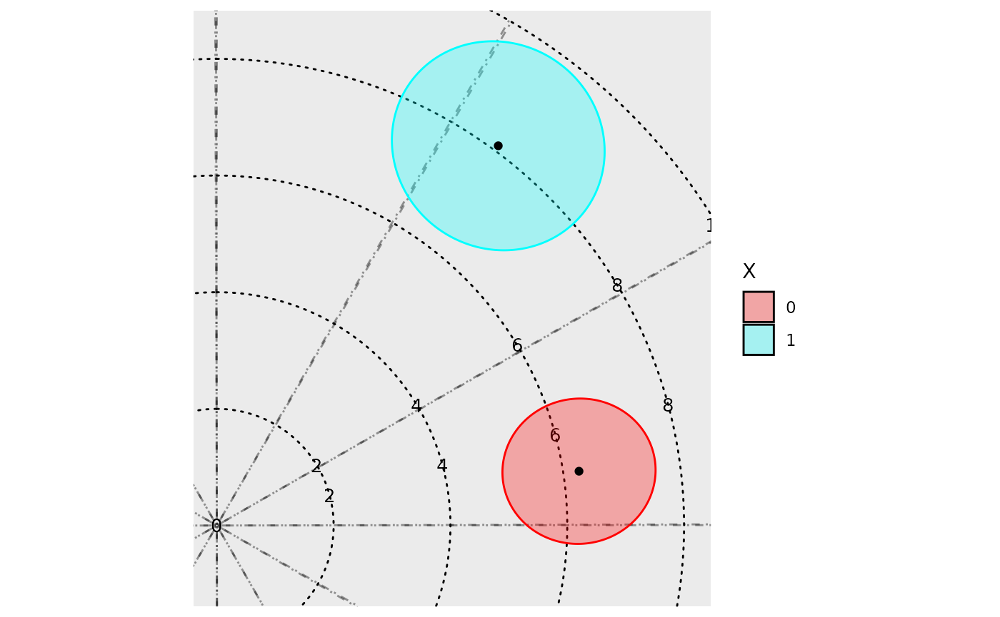
