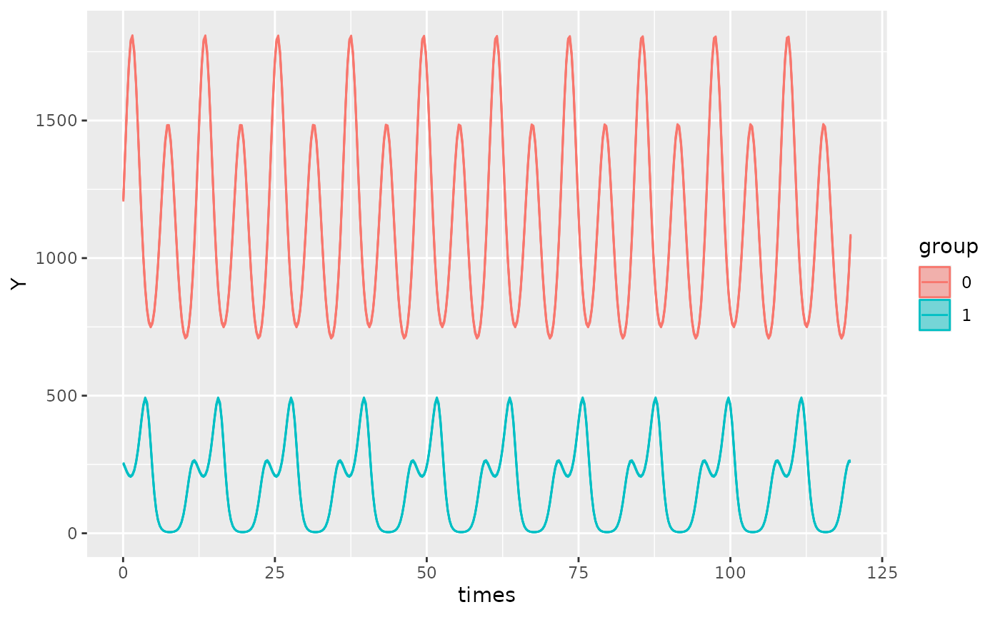
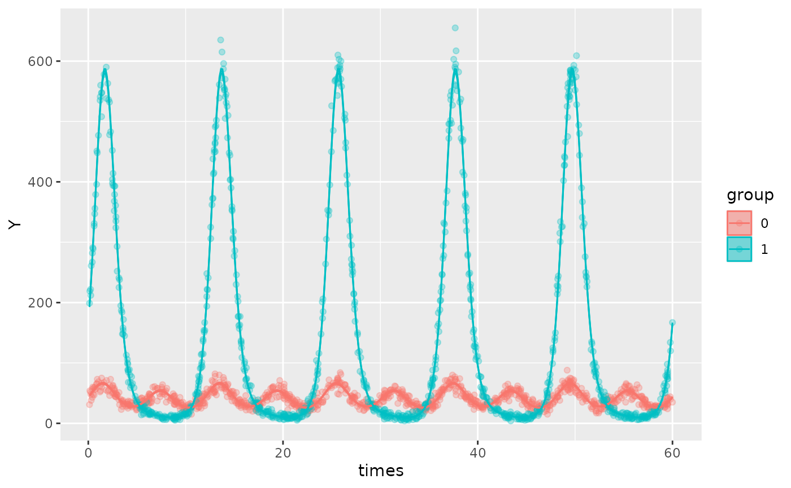
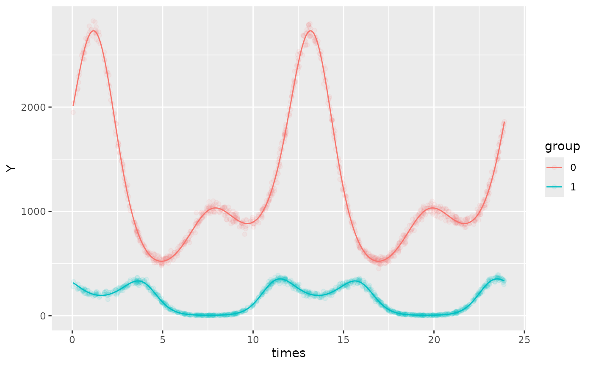

# Multicomponent cosinor modeling

[GLMMcosinor](https://docs.ropensci.org/GLMMcosinor) allows
specification of multi-component cosinor models. This is useful if there
are multiple explanatory variables with known periods affecting the
response variable.

## Generating a two-component model

To generate a multi-component model, set `n_components` in the
[`amp_acro()`](https://docs.ropensci.org/GLMMcosinor/reference/amp_acro.md)
part of the formula to the desired number of components. Then,
optionally assign groups to each component in the `group` argument. If
only one group entry is supplied but `n_components` is greater than 1,
then the single group entry will be matched to each component.

The `period` argument must also match the length of `n_components`,
where the order of the periods corresponds to their assigned component.
For example, if `n_components = 2`, and `period = c(12,6)`, then the
first component has a `period` of 12 and the second a period of 6.
Similarly to the `group` argument, if only one period is supplied
despite `n_components` being greater than 1, then this period will be
matched to each component.

For example:

``` r

library(GLMMcosinor)
testdata_two_components <- simulate_cosinor(
  1000,
  n_period = 10,
  mesor = 7,
  amp = c(0.1, 0.4),
  acro = c(1, 1.5),
  beta.mesor = 4.4,
  beta.amp = c(2, 1),
  beta.acro = c(1, -1.5),
  family = "poisson",
  period = c(12, 6),
  n_components = 2,
  beta.group = TRUE
)
```

``` r

object <- cglmm(
  Y ~ group + amp_acro(
    time_col = times,
    n_components = 2,
    period = c(12, 6),
    group = c("group", "group")
  ),
  data = testdata_two_components,
  family = poisson()
)
object
#> 
#>  Conditional Model 
#> 
#>  Raw formula: 
#> Y ~ group + group:main_rrr1 + group:main_sss1 + group:main_rrr2 +      group:main_sss2 
#> 
#>  Raw Coefficients: 
#>                  Estimate
#> (Intercept)       6.99894
#> group1           -2.60342
#> group0:main_rrr1  0.05248
#> group1:main_rrr1  1.08250
#> group0:main_sss1  0.08753
#> group1:main_sss1  1.68129
#> group0:main_rrr2  0.02926
#> group1:main_rrr2  0.06860
#> group0:main_sss2  0.40068
#> group1:main_sss2 -0.99822
#> 
#>  Transformed Coefficients: 
#>                Estimate
#> (Intercept)     6.99894
#> [group=1]      -2.60342
#> [group=0]:amp1  0.10205
#> [group=1]:amp1  1.99964
#> [group=0]:amp2  0.40175
#> [group=1]:amp2  1.00057
#> [group=0]:acr1  1.03070
#> [group=1]:acr1  0.99875
#> [group=0]:acr2  1.49790
#> [group=1]:acr2 -1.50219
```

In the output, the suffix on the estimates for amplitude and acrophase
represents its component:

- `[group=0]:amp1 = 0.10205`represents the estimate for amplitude of
  `group 0` for the first component

- `[group=1]:amp1 = 1.99964`represents the estimate for amplitude of
  `group 1` for the first component

- `[group=0]:amp2 = 0.40175`represents the estimate for amplitude of
  `group 0` for the second component

- `[group=1]:amp2 = 1.00057`represents the estimate for amplitude of
  `group 1` for the second component

- *Similarly for acrophase estimates*

``` r

autoplot(object)
```



If a multicomponent model has one component that is grouped with other
components that aren’t, the vector input for `group` must still be the
same length as `n_components` but have the non-grouped components
represented as `group = NA`.

For example, if wanted only the first component to have a grouped
component, we would specify the `group` argument as
`group = c("group", NA))` . Here, the first component is grouped by
`group`, and the second component is not grouped. The data was simulated
such that the second component was the same for both groups.

``` r

testdata_two_components_grouped <- simulate_cosinor(
  1000,
  n_period = 5,
  mesor = 3.7,
  amp = c(0.1, 0.4),
  acro = c(1, 1.5),
  beta.mesor = 4,
  beta.amp = c(2, 0.4),
  beta.acro = c(1, 1.5),
  family = "poisson",
  period = c(12, 6),
  n_components = 2,
  beta.group = TRUE
)
```

``` r

object <- cglmm(
  Y ~ group + amp_acro(
    time_col = times,
    n_components = 2,
    period = c(12, 6),
    group = c("group", NA)
  ),
  data = testdata_two_components_grouped,
  family = poisson()
)
object
#> 
#>  Conditional Model 
#> 
#>  Raw formula: 
#> Y ~ group + main_rrr2 + main_sss2 + group:main_rrr1 + group:main_sss1 
#> 
#>  Raw Coefficients: 
#>                  Estimate
#> (Intercept)       3.69558
#> group1            0.31184
#> main_rrr2         0.02612
#> main_sss2         0.39710
#> group0:main_rrr1  0.04946
#> group1:main_rrr1  1.07681
#> group0:main_sss1  0.09546
#> group1:main_sss1  1.67644
#> 
#>  Transformed Coefficients: 
#>                Estimate
#> (Intercept)     3.69558
#> [group=1]       0.31184
#> [group=0]:amp1  0.10752
#> [group=1]:amp1  1.99248
#> amp2            0.39795
#> [group=0]:acr1  1.09273
#> [group=1]:acr1  0.99984
#> acr2            1.50512
```

We would interpret the output the transformed coefficients as follows:

- MESOR for `group 0` is `3.69558`.

- MESOR difference to `group 0` for `group 1` is `[group=1] = 0.31184`

- The estimate for the amplitude of the first component for `group 0`
  is`[group=0]:amp1 = 0.10752`

- The estimate for the amplitude of the first component for `group 1` is
  `[group=1]:amp1 = 1.99248`

- The estimate for the amplitude of the second component is
  `amp2 = 0.39795`and the same for both `group 0` and `group 1`

- The estimate for the acrophase of the first component for `group 0` is
  `[group=0]:acr1 = 1.09273`radians

- The estimate for the acrophase of the first component for `group 1` is
  `[group=1]:acr1 = 0.99984`radians

- The estimate for the acrophase of the second component is
  `acr2 = 1.50512`radians and is the same for both `group 0` and
  `group 1`

``` r

autoplot(object, superimpose.data = TRUE)
```



In this example, it is not strictly necessary to specify
`group = c("group", NA))` since specifying
`group = c("group","group")`still yields accurate estimates:

``` r

object <- cglmm(
  Y ~ group + amp_acro(
    time_col = times,
    n_components = 2,
    period = c(12, 6),
    group = c("group", "group")
  ),
  data = testdata_two_components_grouped,
  family = poisson()
)
object
#> 
#>  Conditional Model 
#> 
#>  Raw formula: 
#> Y ~ group + group:main_rrr1 + group:main_sss1 + group:main_rrr2 +      group:main_sss2 
#> 
#>  Raw Coefficients: 
#>                  Estimate
#> (Intercept)       3.69549
#> group1            0.31048
#> group0:main_rrr1  0.05027
#> group1:main_rrr1  1.07082
#> group0:main_sss1  0.09515
#> group1:main_sss1  1.68461
#> group0:main_rrr2  0.01368
#> group1:main_rrr2  0.03613
#> group0:main_sss2  0.39617
#> group1:main_sss2  0.39776
#> 
#>  Transformed Coefficients: 
#>                Estimate
#> (Intercept)     3.69549
#> [group=1]       0.31048
#> [group=0]:amp1  0.10761
#> [group=1]:amp1  1.99614
#> [group=0]:amp2  0.39641
#> [group=1]:amp2  0.39939
#> [group=0]:acr1  1.08472
#> [group=1]:acr1  1.00457
#> [group=0]:acr2  1.53629
#> [group=1]:acr2  1.48022
```

If a multicomponent model is specified (`n_components > 1`) but the
length of `group` or `period` is 1, then it will be assumed that the one
`group` and/or `period` values specified apply to *all* components. For
example, if `n_components = 2` , but `group = "group"`, then the one
element in this `group` vector will be replicated to produce
`group = c("group","group")`which now has a length that matches
`n_components`. The same applies for `period`.

For instance, the following two
[`cglmm()`](https://docs.ropensci.org/GLMMcosinor/reference/cglmm.md)
calls fit the same models:

``` r

cglmm(
  Y ~ group + amp_acro(times,
    n_components = 2,
    period = 12,
    group = "group"
  ),
  data = testdata_two_components,
  family = poisson()
)
#> 
#>  Conditional Model 
#> 
#>  Raw formula: 
#> Y ~ group + group:main_rrr1 + group:main_sss1 
#> 
#>  Raw Coefficients: 
#>                  Estimate
#> (Intercept)       7.04448
#> group1           -2.22027
#> group0:main_rrr1  0.07222
#> group1:main_rrr1  0.39492
#> group0:main_sss1  0.11292
#> group1:main_sss1  1.11176
#> 
#>  Transformed Coefficients: 
#>                Estimate
#> (Intercept)     7.04448
#> [group=1]      -2.22027
#> [group=0]:amp1  0.13404
#> [group=1]:amp1  1.17982
#> [group=0]:amp2  0.13404
#> [group=1]:amp2  1.17982
#> [group=0]:acr1  1.00181
#> [group=1]:acr1  1.22947
#> [group=0]:acr2  1.00181
#> [group=1]:acr2  1.22947


cglmm(
  Y ~ group + amp_acro(times,
    n_components = 2,
    period = c(12, 12),
    group = c("group", "group")
  ),
  data = testdata_two_components,
  family = poisson()
)
#> 
#>  Conditional Model 
#> 
#>  Raw formula: 
#> Y ~ group + group:main_rrr1 + group:main_sss1 
#> 
#>  Raw Coefficients: 
#>                  Estimate
#> (Intercept)       7.04448
#> group1           -2.22027
#> group0:main_rrr1  0.07222
#> group1:main_rrr1  0.39492
#> group0:main_sss1  0.11292
#> group1:main_sss1  1.11176
#> 
#>  Transformed Coefficients: 
#>                Estimate
#> (Intercept)     7.04448
#> [group=1]      -2.22027
#> [group=0]:amp1  0.13404
#> [group=1]:amp1  1.17982
#> [group=0]:amp2  0.13404
#> [group=1]:amp2  1.17982
#> [group=0]:acr1  1.00181
#> [group=1]:acr1  1.22947
#> [group=0]:acr2  1.00181
#> [group=1]:acr2  1.22947
```

## Generating a three-component model

The plot below shows a 3-component model with the simulated data
overlayed:

``` r

testdata_three_components <- simulate_cosinor(
  1000,
  n_period = 2,
  mesor = 7,
  amp = c(0.1, 0.4, 0.5),
  acro = c(1, 1.5, 0.1),
  beta.mesor = 4.4,
  beta.amp = c(2, 1, 0.4),
  beta.acro = c(1, -1.5, -1),
  family = "poisson",
  period = c(12, 6, 12),
  n_components = 3,
  beta.group = TRUE
)
```

``` r

object <- cglmm(
  Y ~ group + amp_acro(times,
    n_components = 3,
    period = c(12, 6, 12),
    group = "group"
  ),
  data = testdata_three_components,
  family = poisson()
)
autoplot(object,
  superimpose.data = TRUE,
  x_str = "group",
  predict.ribbon = FALSE,
  data_opacity = 0.08
)
```



## Generating models with n-components

Generating a model with `n` components simply involves setting
`n_components` to be the number of desired components and ensuring that
the `period` argument is a vector where each element corresponds the
period of its respective component.
